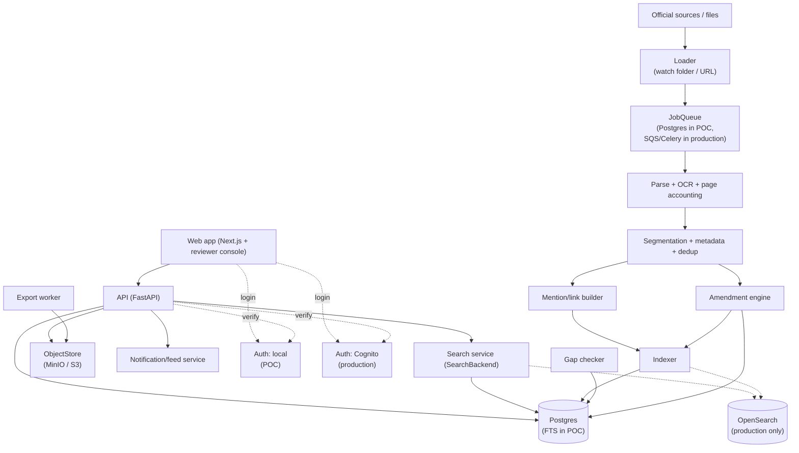
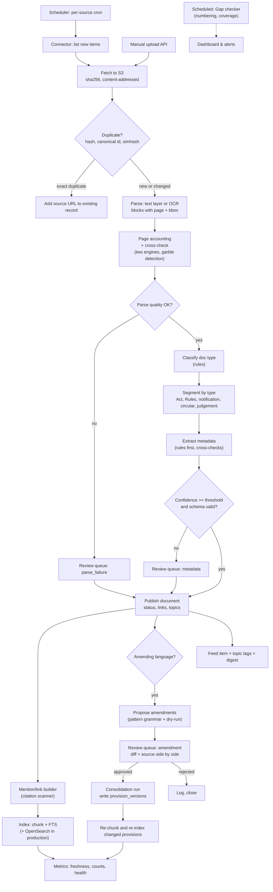

# GST Tax Research Assistant — Technical Specification (TSD)

Draft v0.2 · Based on FSD draft v0.2 (8 Oct 2026)

## 1. Document control

| Item | Value |
| --- | --- |
| Document | Technical Specification Document (TSD) |
| Version | 0.2 |
| Status | Draft. Not frozen. Depends on an FSD that is itself unfrozen. |
| Source requirements | [FSD.md](./FSD.md), draft v0.2 |
| Audience | Engineering, QA, DevOps, security, product owner |
| Scope | MVP (Release 1) build as a POC first, then the production profile. P2 and P3 items are noted only where the MVP design must leave room for them. |
| Open decisions | FSD section 17 lists the open decisions. Each one this TSD depends on is pinned as **Assumption (A-n)** and listed in section 15. |

### 1.1 How to read this document
- Requirement IDs in brackets, such as (FR-ING-07), trace back to the FSD.
- Section 16 maps every MVP FR and NFR ID to a TSD section.
- "Shared corpus" means the legal content curated by the platform team. "Private content" means firm uploads.
- "As-on date" is the FSD term for the date whose law a search result must reflect.
- Two profiles are described: POC (Docker, Postgres FTS, public documents only, built first) and Production (AWS, OpenSearch, RLS, built after POC acceptance). See section 2.4.
- "Deferred (P2)" marks design kept for the second phase rather than deleted.
- Config values (thresholds, weights, TTLs) are starting values. They are tuned against the query set (section 11).

### 1.2 Change log

| Version | Date | Summary |
| --- | --- | --- |
| v0.1 | 7 Oct 2026 | Initial draft |
| v0.2 | 8 Oct 2026 | Re-based on FSD v0.2: non-LLM research repository; POC profile (Docker, Postgres full-text search) and production profile (AWS); LLM, embeddings and answer service moved to Deferred (P2); added extraction-quality, mention index, coverage and no-cap search design; milestones rebuilt |

## 2. Architecture overview

### 2.1 Design principles
| # | Principle | Why |
| --- | --- | --- |
| P-1 | Postgres is the system of record. Search indexes are derived and rebuildable. | Simple DR for NFR-14. One place for tenant isolation. |
| P-2 | The law is stored as dated versions, never overwritten. | Point-in-time answers (FR-COR-02, FR-RES-04). |
| P-3 | Humans approve every change to consolidated law. | FR-ING-08. A wrong amendment is the highest-impact failure. |
| P-4 | Every link and citation shown to the user is generated from the database and opens an existing document paragraph. | FR-RES-02, FR-RES-19. |
| P-5 | Search code talks to interfaces (SearchBackend, JobQueue, ObjectStore) so the POC profile can move to the production profile without redesign. | Clean separation. |
| P-6 | Modular monolith for the API. Separate worker deployments for ingestion and indexing. | Small team, low ops cost. Clear seams to split later. |
| P-7 | Production stays in AWS ap-south-1 with a DR copy in ap-south-2; the POC runs locally on public documents only. | NFR-07. |
| P-8 | No text is silently dropped: every page has a recorded extraction status. | FR-ING-14. |

### 2.2 System diagram


### 2.3 Components
| Component | Responsibility | Requirements |
| --- | --- | --- |
| Web app and reviewer console | Search, reader, matters, saved items, feed, exports; ingestion dashboard and review queues (role-gated routes of the same Next.js app). WCAG 2.1 AA. | FR-RES-*, FR-WS-*, FR-ING-08, FR-ING-10, NFR-12, NFR-13 |
| Auth | MVP: local email + password (argon2) and session JWT. Production: Cognito with TOTP MFA; SSO (SAML/OIDC) is P2. | FR-ADM-01 |
| API service | REST. Authorisation, tenant context, pagination, validation. Hosts domain modules (see section 13). | all |
| Search service | Citation parser, FTS/BM25, keyword filters, as-on filtering, authority ranking, grouped results, query expansion, no result cap (keyset pagination). | FR-RES-01, FR-RES-13..19 |
| Ingestion workers | Loaders (watch folder, fetch-by-URL), parsing and OCR with page accounting (FR-ING-14), cross-check (FR-ING-15), segmentation, metadata extraction, dedup. | FR-ING-01..06, FR-ING-14, FR-ING-15 |
| Amendment engine | Detect amending language, propose patches, verify (dry-run applier), collect review, apply approved ones, rebuild consolidated versions. | FR-ING-07..09, FR-KM-01 |
| Mention/link builder | Scan every document for provision citations; store as links with `link_type='mentions'`. Provision page lists them. | FR-KM-09 |
| Indexer | Chunk by legal structure. Write chunks and the full-text index in Postgres. Production profile: OpenSearch upsert. Deferred (P2): embeddings. | FR-ING-03, FR-RES-01 |
| Notification service | Updates feed, in-app digest. Production only: email digest. Matter impact alerts (P2) hook in here. | FR-WS-03, FR-WS-04 |
| Export worker | DOCX, PDF with provision text, citations, disclaimer and watermark. CSV export. No cap on result set. | FR-WS-08 |
| Quality tooling | Gap detection (FR-ING-17), extraction fixture gate (FR-ING-18, NFR-16), coverage statement (FR-COR-06, FR-RES-17). | FR-ING-17, FR-ING-18, FR-COR-06, FR-RES-17 |
| Deferred (P2) | LLM gateway, answer service, citation verifier, embedding and reranker services. See section 7. | section 7 |

### 2.4 Profiles

| Aspect | POC | Production |
| --- | --- | --- |
| Hosting | Docker Compose on one machine (16 GB RAM+, 100-150 GB disk) | AWS ap-south-1; DR copy in ap-south-2 |
| Database | PostgreSQL 16 with FTS: tsvector + GIN, websearch/phrase queries, pg_trgm for titles | Amazon RDS Postgres Multi-AZ 16; FTS stays as the fallback backend |
| Search | Postgres FTS only. Ranking: ts_rank_cd + authority/jurisdiction/recency/status factors. Evaluate pg_search BM25 if ranking is poor. | Amazon OpenSearch (BM25) behind the SearchBackend interface, adopted if the POC query-set gate shows Postgres FTS is not enough (A-10). |
| Queue | Postgres-based (SELECT ... FOR UPDATE SKIP LOCKED) behind JobQueue interface | SQS or Celery + Redis behind JobQueue interface |
| Object store | MinIO (S3 API) behind ObjectStore interface | Amazon S3 behind ObjectStore interface |
| Auth | Local email + password (argon2), session JWT. No MFA. Reduced roles. | Amazon Cognito with TOTP MFA. Full role set. |
| Email | In-app digest only; no SES | Amazon SES |
| OCR | OCRmyPDF + Tesseract 5 (English) in worker container | Same; optional Textract fallback |
| Loaders | Watch folder + fetch-by-URL on request (admin form / CLI) | Same. Automatic scheduled crawling is P2, after a legal review of site terms. |
| Tenants and RLS | Single shared corpus. No tenant isolation or RLS. Tables keep nullable tenant_id for P2. | RLS and multi-tenant support (P2). |
| Observability | Structured JSON logs + simple metrics page | OpenTelemetry, CloudWatch, Grafana, Sentry |
| IaC | Docker Compose | Terraform + GitHub Actions |
| Data allowed | Public documents only (CGST Act, IGST Act, notifications, circulars, SC/HC/GSTAT judgements from 1 July 2017) | Same plus P2: forms, AAR/AAAR, Council material, state GST, firm uploads |

### 2.5 Interfaces

| Interface | Responsibility | POC implementation | Production implementation |
| --- | --- | --- | --- |
| SearchBackend | Query, filters, highlight, facets, phrase/Boolean/proximity, phrase queries, as-on date filtering | Postgres FTS via SQL | OpenSearch (if POC gate fails) |
| JobQueue | Enqueue, dequeue, mark done, reconcile lost messages (10-min retry). Stages are idempotent. | Postgres SELECT ... FOR UPDATE SKIP LOCKED | SQS or Celery + Redis |
| ObjectStore | Put/get/delete file (S3 API). Raw files, parsed artefacts, exports. | MinIO container with S3 API | Amazon S3 |
| VectorStore | Embed and search (P2 only). Retrieve top-K by similarity with filters. | Not used in MVP | Postgres pgvector or dedicated store |

## 3. Technology stack

### 3.1 Stack table

| Layer | POC | Production | Rationale |
| --- | --- | --- | --- |
| Backend language | Python 3.12 | Python 3.12 | Best ecosystem for parsing and OCR work. One language for API and workers. |
| API framework and ORM | FastAPI + Pydantic v2, SQLAlchemy 2 + Alembic | FastAPI + Pydantic v2, SQLAlchemy 2 + Alembic | Typed models, native async, OpenAPI. Raw SQL easy for temporal work. |
| Frontend | Next.js + TypeScript + Tailwind + Radix/shadcn | Next.js + TypeScript + Tailwind + Radix/shadcn | Fast to build, accessible by default (NFR-12), SSR for reader pages. |
| Primary datastore | PostgreSQL 16 (local or container) with FTS | Amazon RDS Postgres Multi-AZ 16 | Relational model, bitemporal ranges, one backup story. |
| Keyword search | Postgres FTS (tsvector + GIN, ts_rank_cd) | Amazon OpenSearch (BM25) behind SearchBackend | MVP: FTS sufficient if ranking gate passes. Production: swap via interface. |
| Object storage | MinIO (S3 API) in Compose | Amazon S3, SSE-KMS behind ObjectStore | Cheap, durable. Same code path. |
| Job queue | Postgres (SELECT ... FOR UPDATE SKIP LOCKED) behind JobQueue | SQS or Celery + Redis behind JobQueue | Recoverable from DB. Swappable via interface. |
| PDF, DOCX, HTML | pypdfium2 + pdfplumber; python-docx; selectolax | Same | Permissive licences, positions and tables. |
| OCR | OCRmyPDF + Tesseract 5 (English) | Same; optional Textract fallback | Free first pass. Fallback only where needed. |
| Segmentation | Rule-based parsers (regex + PEG via Lark) | Same | Legal numbering is regular. Rules are testable. |
| Auth | Local: email + password (argon2), session JWT | Amazon Cognito (user pool, TOTP MFA, SAML/OIDC later) | POC simple. Production managed. |
| Export and email | python-docx templates + WeasyPrint (PDF); in-app digest | python-docx + WeasyPrint; Amazon SES (ap-south-1) | Letterhead and watermark in both. Email production only. |
| Observability | Structured JSON logs, simple metrics page | OpenTelemetry, CloudWatch, Grafana, Sentry | Local simplicity; production standard. |
| IaC and CI/CD | Docker Compose | Terraform; GitHub Actions | Reproducible. DR rebuild (NFR-14). |
| Compute | Single machine or container | ECS Fargate (API, workers), CPU only | No Kubernetes for MVP scale. |

### 3.2 Deferred (P2): LLM routing

LLM routing, gateway rules and model IDs (Haiku, Sonnet, Opus via AWS Bedrock ap-south-1) are deferred to section 7. The MVP build makes no LLM calls and contains no LLM client code. Rule-based extraction (document type, metadata, amendment patterns) replaces model-based extraction in MVP (see section 5).

### 3.3 Deferred (P2): semantic search

Semantic search (embeddings, reranking, vector store) is deferred to P2 because the MVP achieves its evaluation gates on keyword search alone. BGE-M3 (self-hosted) was the candidate for embeddings: strong legal-text quality, multilingual, no per-call cost. It is added only if the POC query-set must-find recall gate fails. The VectorStore interface is the hook for P2.

### 3.4 When to leave the MVP defaults
| Component | Stay while | Move when | Move to |
| --- | --- | --- | --- |
| Postgres FTS | Query-set recall and ranking meet the gates and keyword p95 < 1.5 s | Ranking quality is below target or p95 above 1.0 s at 200 concurrent users; proximity/facet needs grow | OpenSearch via SearchBackend. Evaluate pg_search BM25 first. |
| Single Postgres writer | CPU under 60% at peak | Sustained above that | Add read replicas for search hydration and reader pages. Then partition large tables (`chunks`, `blocks`) by hash on `doc_id`. |
| Postgres-based JobQueue | Backfill and daily load drain within the 24 h freshness target | Queue lag breaches the 24 h freshness SLO | SQS or Celery + Redis via JobQueue. |
| Docker Compose | POC acceptance gates pass | Production profile deployment starts | ECS Fargate via same code. |
| ECS Fargate | Team under ~6 engineers on infra | Many services to run | EKS. |

### 3.5 Cost

**Rough estimates, not verified against AWS price lists.**

- **POC:** ~$0 cloud cost (local Docker).
- **Production profile, year-one scale, USD/month:** RDS Postgres Multi-AZ (~32 GB class) 500–800; OpenSearch 3 nodes 500–900; ECS Fargate 400–600; Redis/queue, ALB, CloudFront, WAF 150–300; S3 + replication 50–100; security/ops services, NAT, endpoints 250–450; Cognito/SES/Sentry/Grafana 0–150; DR backups 50–100. **Total: ~2,000–3,400 USD/month.** Staging +700–1,500. Textract fallback (one-time, if used) ~400–800. Dropped costs vs v0.1 design: Bedrock usage, GPU, extra Postgres memory for vectors (~700–1,100/month).

## 4. Data model

### 4.1 Conventions
- Primary keys: UUIDv7 (`id uuid`), time-ordered for index locality.
- Every table has `created_at`, `updated_at`. Mutable-by-human tables also have `updated_by`.
- Shared-corpus rows have `tenant_id IS NULL`. Private rows carry the owning `tenant_id`. In the POC, tenant_id is nullable and unused; RLS is introduced with private uploads in P2.
- Every tenant-scoped table has an RLS policy (section 9.1).
- Legal text is **append-only**. A correction creates a new version and supersedes the old one. Nothing is updated in place.
- Valid-time intervals are half-open: `[valid_from, valid_to)`. `valid_to IS NULL` means open-ended.
- Dates of law are `date`. System times are `timestamptz`. All stored in UTC. Law dates are interpreted as IST calendar dates.
- Enum-like columns use Postgres enums or check constraints, listed below.

### 4.2 Tenancy, identity and workspace
| Table | Key columns | Notes |
| --- | --- | --- |
| `tenants` | id, name, plan, status, data_region, retention_delete_after, created_at | Production / P2. One row per firm. A reserved row `platform` owns the shared corpus admin role only. |
| `users` | id, tenant_id, email (citext, unique), cognito_sub, password_hash, display_name, status, mfa_enabled, last_login_at | POC: cognito_sub nullable (null in POC, password_hash for local auth). Platform staff have `tenant_id` of the platform tenant. |
| `roles` | id, code, scope (`platform`/`tenant`), description | Seed: `platform_content_editor`, `platform_admin`, `firm_admin` (P2), `partner` (P2), `professional`, `junior` (P2), `client_viewer` (P3). POC uses `platform_content_editor`, `platform_admin`, `professional` only. |
| `user_roles` | user_id, role_id, tenant_id | A user may hold several roles. |
| `matters` | id, tenant_id, name, client_name, gstins text[], period_from, period_to, state_code, status, created_by | FR-WS-01. `state_code` feeds binding-court weighting (6.6). |
| `matter_members` | matter_id, user_id, access (`view`/`edit`), added_by | FR-ADM-02. RLS joins on this table. |
| `matter_topics` | matter_id, topic_id | Used for alerts (P2) and feed filtering. |
| `saved_items` | id, tenant_id, matter_id null, user_id, target_type, target_id, block_id null, note, visibility (`private`/`team`) | FR-WS-02. `block_id` bookmarks a paragraph. |
| `user_topic_follows` | user_id, topic_id | FR-WS-03. |
| `digest_prefs` | user_id, frequency (`off`/`daily`/`weekly`), send_hour_ist, last_sent_at | FR-WS-04. |
| `feed_items` | id, document_id, topic_ids, title, doc_type, number, doc_date, sections_referred text[], published_at | Shared. Per-user filtering happens at read time. No generated summary. |
| `saved_searches` | id, user_id, matter_id null, query, filters jsonb, as_on, corpus_version, result_count, created_at | FR-RES-11, NFR-11. User-saved searches for later reuse. |
| `conversations` | id, tenant_id, matter_id null, user_id, as_on_default, title | Deferred (P2). |
| `exports` | id, tenant_id, user_id, saved_search_id null, kind, format, s3_key, watermark, approved_by null, created_at | FR-WS-08. Approval clears the "not reviewed" watermark (A-19). |
| `consents` | id, tenant_id, user_id, purpose, notice_version, granted_at, withdrawn_at | Production / P2. DPDP consent record (9.5). |

### 4.3 Documents and parsed content
| Table | Key columns | Notes |
| --- | --- | --- |
| `sources` | id, code, kind (`html_list`/`rss`/`api`/`manual`), base_url, config jsonb, schedule_cron, expected_cadence_hours, enabled, last_success_at, last_new_doc_at, health | FR-ING-01, FR-ING-10. POC: watch folder and fetch-by-URL only. Scheduled crawling P2. |
| `documents` | id, tenant_id null, canonical_id (unique per tenant scope), doc_type, authority_rank (1..11), issuing_authority, number, series, doc_date, in_force_date, status, title, court, bench, state_code, jurisdiction_scope, current_version_id, review_state, topic_ids | Supertype row for every document (FR-COR-01, FR-COR-03). |
| `document_sources` | document_id, source_id, url, first_seen_at, last_seen_at, http_etag | All URLs for one canonical record (FR-ING-06). |
| `document_versions` | id, document_id, version_no, raw_s3_key, raw_sha256, text_sha256, simhash, mime, page_count, parser_version, ocr_used, ocr_conf, parsed_at, supersedes_id | One per distinct byte content or reparse (FR-ING-03). |
| `document_status_history` | id, document_id, status, valid_from, valid_to, cause_link_id, set_by | Status is time-varying. A notification later rescinded was in force earlier (FR-COR-01, FR-AI-04). |
| `blocks` | id, document_version_id, seq, kind (`heading`/`para`/`table`/`table_row`/`footnote`), page, bbox, para_label, structure_path, text, text_sha256, is_boilerplate bool, lang | Atomic addressable units (FR-ING-03). Citations point to a block. `para_label` holds the printed number, such as a judgement's paragraph 23. Nothing deleted: boilerplate and non-English text kept as flagged blocks (FR-ING-16). |
| `page_extractions` | document_version_id, page_no, method (`text`/`ocr`/`failed`), chars_engine_a, chars_engine_b, garble_score, ocr_conf, status, flagged | FR-ING-14, FR-ING-15. Page accounting: every page has a recorded extraction status. Cross-check two engines for garbled text. |
| `page_texts` | document_version_id, page_no, text, tsv tsvector | FR-ING-16. Raw page text fallback indexed for FTS when structure parsing fails. |
| `notifications` | document_id (pk), series, number, year, issue_date, effective_date, parent_power_text, parent_provision_id null, gazette_ref | FR-KM-02. Typed attributes of a notification document. |
| `circulars` | document_id (pk), kind (`circular`/`instruction`/`order`/`rod_order`), number, issue_date, subject, din null | FR-AI-05 status values on `documents.status` plus `circular_status` (`in_force`,`withdrawn`,`held_contrary`). |
| `judgements` | document_id (pk), court_level (`SC`/`HC`/`GSTAT`/`AAR`/`AAAR`), court_name, bench, judges text[], decision_date, parties jsonb, reporter_citations text[], case_numbers text[], outcome (`for_assessee`/`against`/`mixed`/`remand`/`unknown`), outcome_conf, good_law_flag, good_law_note | FR-COR-03, FR-RES-03. `outcome` is reviewer-set where present (outcome filter P2). `good_law_flag` is reviewer-set in MVP (A-18). |
| `judgement_treatments` | id, citing_judgement_id, cited_judgement_id, treatment, block_id, proposed_by (`human`), review_status, reviewed_by | FR-KM-05. Table created in MVP (structure defined), populated in P2. |
| `judgement_summaries` | id, document_version_id, model_id, prompt_version, json, created_at | Deferred (P2). |
| `council_items` | document_id (pk), meeting_no, meeting_date, item_ref | Council material (rank 10). |
| `topics` | id, parent_id, code, label, path ltree | FR-KM-07 taxonomy. Seeded by experts. |
| `document_topics`, `provision_topics` | doc or provision id, topic_id, source (`rule`/`human`), conf | FR-KM-07. Source values: rule-based or human reviewer (not model). |
| `numbering_checks` | series_key, year, expected_range, missing_numbers int[], explained jsonb, checked_at, status | FR-ING-17. Gap detection: check notification numbers per series and year for gaps and alert reviewer. |
| `source_coverage` | source_id, loaded_count, earliest_date, latest_date, known_gaps jsonb, updated_at | FR-COR-06, FR-RES-17. Coverage statement shown on results page and via `GET /v1/coverage`. |
| `synonym_terms` | id, term, expansions text[], kind (`synonym`/`abbreviation`), maintained_by, active | FR-RES-16. Visible query expansion: expert-maintained synonyms and abbreviation list, shown to user. |

`documents.status` values: `in_force`, `amended`, `superseded`, `rescinded`, `struck_down`, `stayed` (FR-COR-01). The current value is a denormalised copy of the latest `document_status_history` row.

`documents.review_state` values: `auto_published`, `pending_review`, `reviewed`. It drives the "pending amendment under review" banner (5.8).

### 4.4 Legal structure: provisions and versions
| Table | Key columns | Notes |
| --- | --- | --- |
| `instruments` | id, code (`CGST_ACT`,`IGST_ACT`,`UTGST_ACT`,`COMP_CESS_ACT`,`CGST_RULES`,`IGST_RULES`,...), kind (`act`/`rules`), short_name, state_code null | The parent for provisions. `state_code` supports FR-COR-04 later (A-3). |
| `provisions` | id, instrument_id, path (ltree, e.g. `s16.2.c`), parent_id, level (`chapter`/`section`/`subsection`/`clause`/`proviso`/`explanation`/`rule`/`schedule_entry`), number_label, ordinal, first_valid_from | Stable identity. One row per provision slot. Never holds text. |
| `provision_versions` | id, provision_id, valid_from, valid_to, heading, text, text_sha256, rec_from, rec_to, created_by_amendment_id, origin (`baseline`/`amendment`/`manual_correction`), block_ids | Dated text. Bitemporal (4.10). |
| `amendments` | id, source_document_id, source_block_id, op (`amend`/`insert`/`substitute`/`omit`/`rescind`/`supersede`), target_provision_id null, target_document_id null, target_locator jsonb, old_text, new_text, effective_from null, effective_condition (`on_date`/`on_notification`/`on_gazette`), bringing_into_force_doc_id null, extraction_method, extraction_conf, dry_run_ok bool, dry_run_diff, review_status (`proposed`/`approved`/`rejected`/`needs_info`/`superseded`), reviewer_id, reviewed_at, review_note, applied_at | FR-ING-07, FR-ING-08. `extraction_method` value: `rule` (pattern grammar); `extraction_conf`: rule-match score. |
| `consolidation_runs` | id, instrument_id, triggered_by_amendment_id, started_at, finished_at, versions_written, status, diff_summary | FR-ING-09. Auditable rebuilds. |

Rate notifications can also amend rate schedules. Those flow into `hsn_sac_rates` (4.6) by the same review mechanism.

### 4.5 Knowledge graph links
One typed, dated edge table. Endpoints are polymorphic.

| Column | Meaning |
| --- | --- |
| id | Edge ID |
| src_type, src_id | `document`, `provision`, `topic`, `hsn` |
| dst_type, dst_id | Same domain. For provisions, the edge points at `provisions.id` (stable), not a version. |
| link_type | See below |
| effective_from, effective_to | When the relationship takes effect in law. Null if not applicable. |
| source_block_id | The block that evidences the edge |
| confidence | 0 to 1 |
| review_status | `auto`, `approved`, `rejected` |
| origin | `rule`, `human`. MVP uses rule-based and human reviewer sources only. Model-based links (`model` origin) return in P2. |

`link_type` values by FSD requirement:

| Group | Values | FSD |
| --- | --- | --- |
| Amending | `amends`, `inserts`, `substitutes`, `omits`, `rescinds`, `supersedes` | FR-KM-01 |
| Power | `issued_under` (notification to provision) | FR-KM-02 |
| Interpretive | `clarifies` (circular to provision), `upholds`, `reads_down`, `sets_aside` (judgement to circular) | FR-KM-03 |
| Judgement | `interprets` (judgement to provision), `cites` (judgement to judgement) | FR-KM-04 |
| Mentions | `mentions` (document to provision, from mention index) | FR-KM-09 |
| Treatment (P2) | `followed`, `relied_on`, `distinguished`, `doubted`, `overruled`, `reversed_in_appeal`, `stayed` | FR-KM-05 |
| Appeal (P2) | `appeal_of` | FR-KM-06 |
| Taxonomy | `tagged_with` (kept in the topic tables instead) | FR-KM-07 |

Indexes: `(dst_type, dst_id, link_type)`, `(src_type, src_id, link_type)`, and a partial index on `review_status='approved'`. Graph expansion in retrieval (6.4) uses these. No graph database at MVP.

### 4.6 HSN/SAC and rates
| Table | Key columns | Notes |
| --- | --- | --- |
| `hsn_sac_codes` | id, scheme (`hsn`/`sac`), code, level (chapter/heading/subheading/tariff_item), parent_code, description, valid_from, valid_to | Code hierarchy for prefix matching. |
| `hsn_sac_rates` | id, code_id, tax_head (`cgst`/`sgst_utgst`/`igst`/`cess_adv`/`cess_specific`), rate_pct numeric, specific_amount numeric null, unit null, condition_text, schedule_ref, entry_ref, notification_id, source_block_id, valid_from, valid_to, rec_from, rec_to, review_status | FR-KM-08, UJ-3. One row per head per interval. A rate change closes the old row's `valid_to` and opens a new one. |

Rate lookup for a code and date uses the most specific code that has a rate row in force, walking up the hierarchy (item, subheading, heading, chapter). The result always shows the notification, entry and condition text. Where a rate depends on a condition, the API returns all candidate rows and flags the condition rather than choosing (UJ-3).

### 4.7 Retrieval tables
| Table | Key columns | Notes |
| --- | --- | --- |
| `chunks` | id, tenant_id null, document_id, document_version_id, provision_version_id null, chunk_kind, structure_path, heading_path, text, token_count, text_sha256, block_start_id, block_end_id, page_start, page_end, para_label, authority_rank, doc_type, court_level, state_code, status_at_index, valid_from, valid_to, topic_ids, tsv tsvector, is_current bool | Immutable. A changed text creates a new chunk and sets the old `is_current=false`. Validity columns copied from the parent so filters need no join. `tsv`: tsvector column, GIN indexed for full-text search. |
| `chunk_embeddings` | chunk_id, model_id, dim, embedding halfvec(1024), created_at | Deferred (P2). Primary key `(chunk_id, model_id)`. HNSW index per model. |
| `os_index_state` | chunk_id, indexed_at, index_name | Production profile only. Tracks the OpenSearch copy so a reindex can be audited. |

Chunk immutability means retrievals stay consistent across time (FR-AI-12, NFR-11).

### 4.8 Review tasks (and Deferred AI tables)
| Table | Key columns | Notes |
| --- | --- | --- |
| `review_tasks` | id, kind (`amendment`/`metadata`/`parse_failure`/`miss_report`/`treatment`), subject_type, subject_id, priority, assignee_id, status (`open`/`in_review`/`done`/`rejected`), sla_due_at, opened_at, closed_at, resolution jsonb | One queue table for all human review (5.8). MVP kinds: amendment, metadata, parse_failure, miss_report (report a search miss); treatment deferred to P2. |
| `answers`, `answer_claims`, `answer_citations`, `feedback` | — | Deferred (P2). See section 7. |

### 4.9 Operations and audit
| Table | Key columns | Notes |
| --- | --- | --- |
| `ingestion_jobs` | id, source_id, document_id null, url, stage, status, attempt, error_code, error_detail, started_at, finished_at, discovered_at, published_at | State machine for the pipeline (5.2). `published_at - discovered_at` is the freshness metric. |
| `llm_usage` | — | Deferred (P2). NFR-15. |
| `audit_log` | id, ts, tenant_id, actor_user_id, actor_role, action, object_type, object_id, ip, user_agent, request_id, detail jsonb, prev_hash, row_hash | FR-ADM-03. Append-only. Hash-chained for tamper evidence. |
| `corpus_versions` | id, bumped_at, reason | A counter bumped on every publish. Used for cache keys and for search provenance. |

### 4.10 Point-in-time design
**Model.** Two time axes on `provision_versions` and `hsn_sac_rates`.

| Axis | Columns | Meaning |
| --- | --- | --- |
| Valid time | `valid_from`, `valid_to` | When the text was the law. Taken from the amending instrument's effective date. |
| Record time | `rec_from`, `rec_to` | When our system held that belief. Set by the consolidation run. |

Why both. A notification can take effect retroactively, or a reviewer can fix a wrong date later. Valid time answers "what was the law on date X". Record time answers "what did we show a user on date Y", which is what an audit needs (NFR-11).

**Constraints.**

```sql
-- No two current versions of a provision overlap in valid time.
CREATE EXTENSION IF NOT EXISTS btree_gist;
ALTER TABLE provision_versions ADD CONSTRAINT pv_no_overlap
  EXCLUDE USING gist (
    provision_id WITH =,
    daterange(valid_from, valid_to, '[)') WITH &&
  ) WHERE (rec_to IS NULL);
```

`hsn_sac_rates` gets the same constraint on `(code_id, tax_head, condition_key)`.

**Query: law on date X, as we know it now.**

```sql
SELECT pv.*
FROM provision_versions pv
WHERE pv.provision_id = :pid
  AND pv.valid_from <= :asof
  AND (pv.valid_to IS NULL OR pv.valid_to > :asof)
  AND pv.rec_to IS NULL;
```

**Query: what we showed on record date Y (audit replay).** Replace `rec_to IS NULL` with `pv.rec_from <= :rec AND (pv.rec_to IS NULL OR pv.rec_to > :rec)`.

**Applying an amendment.** The amendment engine (5.9) does the following in one transaction:

1. Load the provision's current versions ordered by `valid_from`.
2. Close the affected interval(s) by setting `rec_to = now()` on the rows being replaced.
3. Insert replacement rows with the new `valid_from`/`valid_to` and `rec_from = now()`. An amendment effective on date E splits the open interval at E. Rows before E are copied unchanged with new record times.
4. Write a `consolidation_runs` row and bump `corpus_versions`.
5. Re-chunk and re-index only the changed provisions (5.10).

**Late and retrospective amendments.** If E is earlier than the amendment's approval date, the same steps apply. Old rows are closed in record time, not deleted. The audit replay still shows what was displayed before.

**Amendments not yet in force.** An amendment with `effective_condition` other than `on_date`, or a future date, is stored with `review_status='approved'` but `effective_from NULL` or in the future. It does not alter versions until its date or its bringing-into-force notification is ingested.

**Ordering rule.** Where two amendments touch the same provision, apply them in order of `effective_from`, then instrument issue date, then document ID. The dry run (5.7) must succeed at each step.

**Period queries (A-15).** A question about a period such as a financial year returns the set of versions overlapping `[from, to]`, plus the change dates inside the period. The search layer returns each segment separately.

**Status on a date.** Document-level status uses `document_status_history` with the same valid-time test. A circular withdrawn in 2021 is `in_force` for an as-on date in 2019.

**Diff between dates (FR-RES-08).** Fetch the two versions, run a word-level diff (`diff-match-patch`), return a structured diff. Cache by `(provision_id, date_a_version_id, date_b_version_id)`.

### 4.11 Indexing and sizing
Planning numbers (A-25): 500,000 documents in year one, about 20 chunks each, roughly 10M chunks.

| Item | Estimate |
| --- | --- |
| `chunks` + `blocks` text | ~40 to 60 GB |
| OpenSearch index (with replicas) | Production profile only. ~80 to 120 GB |
| S3 raw and parsed | under 1 TB |

**POC profile:** 16 GB RAM+ and 100-150 GB disk (A-28). Postgres with full-text search indexes.

**Production profile:** Postgres ~32 GB RAM class (re-size with real numbers at M5). OpenSearch BM25 index.

Key indexes: GiST exclusion on versions (4.10), btree `(provision_id, valid_from)`, btree `(tenant_id, is_current, doc_type)` on `chunks`, trigram GIN on `documents.title` and `number`, GIN on `chunks.tsv` and `page_texts.tsv` for full-text search, and the `links` indexes (4.5).

## 5. Ingestion pipeline design

### 5.1 Flow


### 5.2 Stages and state
Each stage is one idempotent task. State lives in `ingestion_jobs`. A reconciler runs every 10 minutes and re-enqueues any job whose status has not moved within its stage timeout. A lost message is therefore not a lost document.

| # | Stage | Input | Output | Idempotency key | Timeout |
| --- | --- | --- | --- | --- | --- |
| 1 | `discover` | Source config | Job rows for new URLs | `(source_id, url)` | 5 min |
| 2 | `fetch` | URL | Raw file in the ObjectStore, `document_versions` row | `sha256(bytes)` | 5 min |
| 3 | `dedup` | Version | Link to canonical doc or new doc row | canonical ID | 1 min |
| 4 | `parse` | Raw file | `blocks`, `page_extractions` with page accounting and two-engine cross-check | `(version_id, parser_version)` | 15 min |
| 5 | `classify` | Blocks | `doc_type`, `authority_rank` (rule-based) | version ID | 2 min |
| 6 | `segment` | Blocks | `structure_path` on blocks, provision candidates | `(version_id, segmenter_version)` | 5 min |
| 7 | `extract_meta` | Blocks | Metadata, links (rule-based extraction, cross-checks) | same | 5 min |
| 8 | `publish` | All above | Document live, `review_state`, `corpus_versions` bump | version ID | 1 min |
| 9 | `mentions` | Published doc | `links` with `link_type='mentions'` (provision citations in document) | version ID | 5 min |
| 10 | `index` | Published doc | `chunks` with FTS tsvector + `page_texts`; OpenSearch bulk upsert (production) | `chunk.text_sha256` | 20 min |
| 11 | `detect_amend` | Published doc | `amendments` (proposed, rule-based pattern grammar) and `review_tasks` | `(document_id, block_id, op)` | 10 min |
| 12 | `consolidate` | Approved amendment | `provision_versions`, `consolidation_runs` | amendment ID | 10 min |
| 13 | `feed` | Published doc | `feed_items` (title, type, number, date, sections_referred; no summary), topic tags | document ID | 2 min |
| 14 | `gap_check` | Scheduled | `numbering_checks`, `source_coverage`, alerts | n/a | Daily |

A document is searchable after stage 10, not after human review (A-20). Anything that needs review is searchable but flagged `pending_review`. This is how FR-ING-01 and the 24-hours-after-loading acceptance (section 5 of the FSD) hold even when review lags.

### 5.3 Source connectors
POC loaders: watch folder and fetch-by-URL (admin form / CLI) for each source. Scheduled crawling is P2 and requires a legal review of site terms (A-29).

| Source (FR-ING-01) | POC loader | P2: Scheduled crawler | Notes |
| --- | --- | --- | --- |
| CBIC GST portal (notifications, circulars, instructions, orders) | fetch-by-URL + manual file | `html_list`, 6-hourly | Page layout changes require manual fallback. Selectors live in config with tests on saved HTML. |
| Supreme Court site | fetch-by-URL + manual file | `html_list`, 6-hourly | Judgements and orders. |
| High Court sites | fetch-by-URL + manual file | One connector per court, shared base class, 6-hourly | Ten or more sites. Add courts incrementally by volume. |
| GSTAT | fetch-by-URL + manual file | `html_list`, daily | Appeals and orders. |
| e-Gazette | fetch-by-URL + manual file | `html_list` or search form, daily | Used to cross-check gazette references and dates. |
| GST Council site | fetch-by-URL + manual file | P2. | Meeting material, press releases. |
| AAR / AAAR portals | fetch-by-URL + manual file | P2. | Advance rulings. |
| Manual upload | API | n/a | FR-ING-02. Platform admin uploads to shared corpus. Users upload private content (P2). |
| Licensed case-law feed | Disabled | `api` adapter, P2 | FR-ING-12 is P2. Interface is defined now (A-2). |

**Connector rules (apply to all connectors):**

- Respect each site's terms and robots rules. A legal review of scraping terms is a pre-launch task (risk R-3).
- Rate-limit per host (default 1 request per 2 s, configurable). Identify with a stable user agent. *(Applies when scheduled crawling is enabled.)*
- Retry with backoff. After N failures, mark the source `degraded` and alert.
- Conditional requests (ETag, Last-Modified) where supported. *(Applies when scheduled crawling is enabled.)*
- A source with no new document for `3 x expected_cadence_hours` raises a "stopped yielding" alert (FR-ING-10). *(Applies when scheduled crawling is enabled.)*
- Manual fallback: the reviewer console has an "add by URL or file" form that runs the same pipeline.

### 5.4 Duplicate detection (FR-ING-06)
Three layers, in order.

| Layer | Test | Result |
| --- | --- | --- |
| 1. Byte hash | `sha256(raw bytes)` seen before | Attach source URL to the existing version. Stop. |
| 2. Canonical ID | Computed ID equals an existing document's | Same document, possibly a new rendering. Create a new `document_versions` row, keep the canonical document. |
| 3. Near-duplicate | Normalised-text simhash within Hamming distance 3 and same date and court (judgements) | Flag as probable duplicate. Auto-merge if the case number matches. Otherwise send to the metadata review queue. |

Canonical IDs are built from normalised metadata:

| Type | Canonical ID format |
| --- | --- |
| Notification | `ntf:<series>:<number>/<year>` where series is a normalised code, e.g. `ntf:CT(R):11/2017` |
| Circular | `cir:<number>/<number>/<year>` e.g. `cir:183/15/2022` |
| Instruction or order | `ins:` or `ord:` plus number and year |
| Judgement | `jdg:<court_code>:<normalised case number>:<decision_date>` |
| Provision | `prov:<instrument_code>:<path>` e.g. `prov:CGST_ACT:s16.2.c` |
| Act or Rules instrument | `inst:<code>` |

Normalisation rules (case, whitespace, dash variants, series spelling) are unit-tested. The series alias table is expert-maintained (A-26).

### 5.5 Parsing per document type (FR-ING-03, FR-ING-04, FR-ING-14, FR-ING-15, FR-ING-16)
| Step | Approach |
| --- | --- |
| Per-page text-layer test | Per page, if text density is above a threshold use the text layer, otherwise OCR that page. |
| Two-engine cross-check | pypdfium2 vs pdfplumber per page; differ beyond a margin or garbled (`(cid:` patterns, private-use characters, high non-word ratio) -> OCR the page and flag. Results in `page_extractions` table. |
| Garble detection | Identify broken font encoding (private-use chars, non-word patterns). Pages with high garble score are OCR'd and flagged. |
| OCR | OCRmyPDF with Tesseract (`eng`), deskew and clean. Page-level confidence stored. Pages below threshold are retried with Textract if enabled (production only), else sent to review. |
| Layout and blocks | pdfplumber reading order, column detector for two-column gazettes, repeated header and footer stripping. One block per paragraph or table row with `page`, `bbox`, `seq`, `para_label`. DOCX and HTML use native structure. |
| Boilerplate and multilingual | Boilerplate (headers, footers) and non-English text kept as flagged blocks (`is_boilerplate`, `lang`), indexed at low weight (FR-ING-16). Raw page text fallback in `page_texts` table if structure parsing fails. Original page one click away. |
| Tables | pdfplumber extraction. Rate schedule rows keep their column headers so meaning survives chunking. Failed tables fall back to raw page text. Failed tables are flagged. |

**Segmentation per type:**

| Type | Method | Output |
| --- | --- | --- |
| Acts | Lark grammar over numbering: chapter, section `16.`, sub-section `(2)`, clause `(c)`, sub-clause `(i)`, `Provided that`, `Explanation` | `provisions` + baseline `provision_versions` |
| Rules | Same grammar with rule numbering, plus forms and annexures kept as separate blocks | Same |
| Notifications | Preamble, numbered paragraphs, schedules and tables. Amending paragraphs split into one unit per instruction. | Blocks with `structure_path`; rate rows to `hsn_sac_rates` candidates |
| Circulars | Header (number, date, subject, DIN), then numbered paragraphs | Blocks with paragraph labels |
| Judgements | Header (court, bench, parties, case numbers, date), then paragraphs. Paragraph labels by heading patterns where present (facts, issues, findings, order); otherwise unlabelled. Printed paragraph numbers always kept. | Blocks with section labels |
| Firm uploads | Generic paragraph split. No legal-structure assumptions. | Blocks, private chunks |

**Quality gates:** if numbering has gaps, duplicates or a non-monotonic sequence, the document is routed to the parse-failure queue with the problem highlighted. Rule-based repair may propose a fix; a human approves.

### 5.6 Metadata extraction (FR-ING-05)
1. Rule-based extractors run first: notification number and series, circular number, dates in common formats, sections referred to (via the citation parser, 6.3), HSN/SAC patterns, court names, case numbers. For judgements: parties, bench, judges, reporter citation. Output is a JSON object validated against a Pydantic schema.
2. Cross-checks: number in header equals number in filename or title; date is plausible; referred sections exist in `provisions`; court is in the court list.
3. Each field has a confidence. Document confidence is the minimum of required fields. Below threshold (default 0.85) goes to the `metadata` review queue.
4. Sample audit: 2% of auto-published documents are queued for spot check weekly. This produces the metadata accuracy metric (FSD section 15).

### 5.7 Amendment detection and patching (FR-ING-07)
**Trigger.** Any document of type notification, Finance Act, Removal of Difficulties Order, or an Act itself. The detector scans for the cue words "substituted", "inserted", "omitted", "rescinded", "in supersession of", "amended", "shall be deemed", "with effect from".

**Extraction (rule-based).**

1. A deterministic splitter breaks the operative part into instruction units (one per numbered paragraph or "in rule X, ..." clause).
2. Pattern grammars (Lark-based) parse each unit into a structured proposal with fields: `op` (amend, insert, substitute, omit, rescind, supersede); `target` (instrument and locator as text); `old_text` and `new_text` (verbatim). Common instruction forms:
   - "for the words X, substitute Y"
   - "after [section/clause] X, insert Y"
   - "omit [section/clause] X"
   - "in supersession of [reference], [new text]"
   - "shall be deemed to [condition]"
   - "with effect from [date]"
   
   If the grammar cannot parse a unit, it is shown as raw text for manual entry in the review queue.

3. The `target` text is resolved to a `provision_id` by the citation parser. Unresolved targets stay `needs_info`.
4. **Verbatim check.** `new_text` and `old_text` must be exact substrings of the source blocks. Otherwise the proposal is rejected automatically and the unit goes to review as raw text.
5. **Dry-run patch.** A deterministic applier applies the op to the provision text valid at the day before `effective`:
   - `substitute` with words: `old_text` must occur in the current text. If it occurs more than once and no occurrence is specified, fail.
   - `insert`: anchor ("after the words ...", "after clause (c)") must resolve to one position.
   - `omit`: the target text must exist.
   - Result is stored as `dry_run_diff`. `dry_run_ok` is true only if every step applied cleanly.
6. A proposal with `dry_run_ok=false` is still sent to review, marked high priority, with the failure reason.
7. **ALL proposals go to human review.** A reviewer approves, edits, or rejects each one.

**Effective date handling.**

| Case | Handling |
| --- | --- |
| Explicit date | Use it. Cite the source phrase. |
| "With effect from the date of publication in the Gazette" | Use the gazette date. Cross-check against the e-Gazette record. |
| "On such date as the Government may notify" | `effective_condition='on_notification'`. Held until the bringing-into-force notification is ingested and linked. |
| Retrospective | Allowed. Handled by record-time columns (4.10). The reviewer is shown a banner. |

**Side effects of an approved amendment.** Besides the provision versions, the engine writes `links` edges (`substitutes`, `inserts`, ... ) with `effective_from` (FR-KM-01) and updates `document_status_history` for rescinded or superseded instruments.

### 5.8 Human review queue (FR-ING-08)
One `review_tasks` queue with kinds: `amendment`, `metadata`, `parse_failure`, `miss_report`, `treatment` (P2).

| Feature | Design |
| --- | --- |
| Amendment, metadata, parse_failure | Layout: Left: source PDF page at the cited block. Centre: extracted proposal. Right: dry-run diff of the consolidated text (amendments only). Actions: Approve, edit then approve, reject, mark needs info. Editing never changes `new_text` silently: edits are stored as a reviewer override with the original kept. |
| Miss report | User reports a search miss via UI (not found in results). Task: query, filters, as-on date. Reviewer confirms miss or fixes the ingestion. Confirmed misses are added to the query set for evaluation. |
| Assignment | Round-robin among `platform_content_editor` users. Priority by instrument (Act and Rules first), then age. |
| SLA | `sla_due_at` set to 8 working hours after creation for amendments (A-6). Overdue tasks alert the platform admin. |
| Approval rule | One reviewer for MVP, plus a weekly 10% second-reviewer audit sample (A-12). Acts and Rules amendments have a configurable switch to require two reviewers. |
| Log | Reviewer, timestamp and source recorded on the amendment row and in `audit_log` (FR-ING-08). |
| Pending banner | While any proposed amendment targets a provision, the reader shows "An amendment affecting this provision is awaiting review". |

### 5.9 Consolidation (FR-ING-09, NFR-04)
- Triggered by the approval event, not by a schedule. Typical completion is within minutes, well inside the 48 h target.
- Baseline: the original text of each Act and Rules, as first in force, is loaded and verified by content editors (A-17). Historic amendments since 1 July 2017 are back-filled through the same pipeline (milestone M4).
- The consolidation run replays approved amendments for the affected instrument in the ordering rule of 4.10. It writes new `provision_versions` and closes superseded ones.
- **Full replay check.** A nightly job replays all approved amendments from the baseline for each instrument into a scratch schema. It compares the result to live `provision_versions`. Any difference raises a P1 alert. This catches ordering bugs and manual edits.
- **Manual correction path.** A content editor can create a `manual_correction` version with a mandatory reason and a second-person approval. It is logged.
- The same engine handles rate schedules: approved rate changes close and open `hsn_sac_rates` rows.

### 5.10 Indexing
1. Chunk by legal structure (6.2).
2. Compute `text_sha256`. If a chunk with the same hash and validity exists, skip.
3. Generate tsvector for full-text search and store in `chunks.tsv` (MVP: Postgres GIN index).
4. POC profile: store the chunk in `chunks` and `chunks.tsv`. Chunks are searchable via Postgres FTS.
5. Production profile: bulk upsert to OpenSearch with the same chunk ID via the SearchBackend interface.
6. Mark the chunk `is_current`. Mark replaced chunks `is_current=false` and set their OpenSearch `is_current` false (not deleted, so audit replay still works).
7. Bump `corpus_versions`. Invalidate search caches.

### 5.11 Monitoring and dashboard (FR-ING-10)
| Metric | Source | Alert |
| --- | --- | --- |
| Documents discovered, parsed, awaiting review, failed (per source, per day) | `ingestion_jobs` | Failure rate above 5% in 24 h |
| Freshness: `published_at - discovered_at`, p95 | `ingestion_jobs` | p95 above 12 h (SLO is 24 h, NFR-04) |
| Source health: time since last new document vs expected cadence | `sources` | Above 3x cadence |
| Review queue depth and age | `review_tasks` | Any amendment task past SLA |
| Parse quality: OCR confidence, numbering anomalies | `document_versions` | Drop of more than 10 points week on week |
| Page accounting: extraction status per page | `page_extractions` | Pages with method `failed` or flagged garble_score |
| Cross-check disagreements: two-engine differences | `page_extractions` | Pages where chars_engine_a and chars_engine_b differ beyond margin |
| Numbering gaps: missing numbers in series | `numbering_checks` | Any unexplained gaps in notification or circular numbers |
| Coverage freshness: source load recency | `source_coverage` | Any source older than expected_cadence |
| Consolidation replay mismatches | nightly job | Any mismatch |
| Queue lag | Job queue | Above 30 min |

The dashboard is a page in the reviewer console backed by SQL views. The same metrics export to Grafana.

### 5.12 Failure handling
Poison documents (three failed attempts) move to `failed` and show in the dashboard. Re-processing is a button on the job and is version-aware: `parser_version` and `segmenter_version` are part of the idempotency key, so bulk re-runs with a diff report (FR-ING-11, P2) need no redesign. Raw files are immutable.

### 5.13 Extraction quality gate (FR-ING-18, NFR-16)
**Fixture set:** Expert-checked PDFs representing real diversity: digital (born-digital text layer), scanned (OCR required), two-column (gazette layouts), table-heavy (rate schedules), bilingual (Hindi + English gazette sections). Maintained under `eval/fixtures/`.

**Metric:** Word recall >= 99.5%. Measured as (words correctly extracted) / (words in ground truth per page).

**Test:** Run on every parser or OCR change in CI. Block release if metric drops below gate.

**Page accounting invariant:** pages in = pages out (every page has a recorded extraction status in `page_extractions`). Test in CI on every ingest run.

### 5.14 Gap detection and coverage (FR-COR-06, FR-RES-17)
**Numbering checks (FR-ING-17):** After each load, scan notification series (e.g. CT, CT(R), IT) and year for missing numbers. Stored in `numbering_checks`. Unexplained gaps (not in `explained` jsonb) alert the reviewer and feed the dashboard.

**Coverage statement:** Table `source_coverage` tracks per source: loaded_count, earliest_date, latest_date, known_gaps (JSON), updated_at. Refreshed after each source load.

**Endpoint:** `GET /v1/coverage` returns coverage by source, shown on results page (FR-RES-17) and on a dedicated dashboard page (FR-COR-06).

## 6. Search and retrieval design

### 6.1 Retrieval stack at a glance
Stages for MVP: (1) citation parser, (2) keyword search through SearchBackend (phrase, Boolean, proximity, stemming), (3) filters and as-on predicate, (4) authority / jurisdiction / recency / status weighting, (5) grouping by document type with counts, (6) hydration (text, citation label, status, highlights). Graph expansion (links and mentions) powers the provision page, not the ranked list. No vector search, no RRF fusion, no rerank in MVP (Deferred P2).

### 6.2 Chunking by legal structure
No fixed token windows. Chunk boundaries follow the structure produced by segmentation (5.5). Each chunk carries a heading path for display, for example `CGST Act > Chapter V > s.16 > (2) > (c)`.

| Document type | Chunk unit | Size rule | Notes |
| --- | --- | --- | --- |
| Act or Rules provision | One chunk per **leaf provision version**: a sub-section with its clauses and provisos | Target up to 600 tokens. If longer, split at clause boundaries. Never split inside a clause. | Provisos and explanations stay attached to the parent they qualify. A parent summary chunk (section heading plus sub-section list) is also stored for navigation. |
| Definitions (e.g. a definitions section) | One chunk per defined term | Any | So "supply" or another term is directly retrievable. |
| Notification | One chunk per numbered paragraph. Amending instructions are one chunk each. | Up to 600 tokens | Preamble chunk includes number, date, series, and parent power. |
| Rate schedule rows | One chunk per row, with column headers and schedule title repeated | Small | Also populates `hsn_sac_rates`. Chunks are for text search. Rate answers use the structured table. |
| Circular, instruction, order | One chunk per paragraph, merged with adjacent paragraphs under 80 tokens | 150 to 500 tokens | Subject line is prefixed. |
| Judgement | Paragraph groups within a section label (facts, issues, arguments, findings, order). Merge short paragraphs up to ~500 tokens. Overlap one paragraph for findings. | 200 to 500 tokens | `para_label` range stored so a citation reads "para 23 to 25". Header gets its own chunk. |
| Firm uploads | Paragraph groups up to ~400 tokens | | Private. `tenant_id` set. |

Every chunk stores `block_start_id` and `block_end_id`. The UI opens the source at those blocks (FR-RES-05).

Version handling: a provision chunk has `valid_from`/`valid_to` copied from its `provision_version`. When a new version is created, new chunks are written. Old chunks stay, with `is_current=false`, so as-on queries over history work.

### 6.3 Citation parser (FR-RES-02)
Deterministic, written in Lark (PEG-style). It runs first on every query. Matches resolve against the database, never guessed.

**Examples from the FSD**

| User types | Resolves to |
| --- | --- |
| `s.16(2)(c) CGST` | `prov:CGST_ACT:s16.2.c` |
| `Notf 11/2017-CT(R)` | `ntf:CT(R):11/2017` |
| `Circular 183/15/2022` | `cir:183/15/2022` |
| A case name or reported citation | `jdg:` via party-name and citation lookup |

**Grammar (simplified)**

```
query          = ws? citation ( ws+ citation )* ws? | free_text
citation       = provision_cite | rule_cite | notif_cite | circular_cite | case_cite

provision_cite = sec_kw ws? sec_no sub* (ws? act_alias)?
rule_cite      = rule_kw ws? rule_no sub* (ws? rules_alias)?
sec_kw         = "s." | "s" | "sec." | "sec" | "section"
rule_kw        = "r." | "rule"
sec_no         = DIGITS LETTER?                    # e.g. 16, 74A
rule_no        = DIGITS LETTER?
sub            = "(" sub_tok ")"
sub_tok        = DIGITS LETTER? | LETTER+ | ROMAN  # (2), (c), (i), (2A)
act_alias      = "CGST" | "IGST" | "UTGST" | "SGST" | "Comp Cess Act" | ...  # from alias table
rules_alias    = "CGST Rules" | "IGST Rules" | ...

notif_kw       = "notf" | "notf." | "notification" | "notif" | "no."
notif_cite     = notif_kw ws? ("no." ws?)? DIGITS "/" YEAR "-" series
series         = series_code ( "(" "R" ")" )?       # CT, CT(R), ... from alias table
circular_cite  = ("circular" | "circ.") ws? ("no." ws?)? DIGITS "/" DIGITS "/" YEAR

case_cite      = party ws ("v." | "vs." | "v") ws party (ws "(" YEAR ")")?
               | reporter_cite                      # patterns from config
               | case_number_cite                   # court-specific patterns from config
```

**Parsing notes**

- Case-insensitive. Spaces, dots and dash variants (hyphen, en dash) are normalised first.
- `ROMAN` versus `LETTER`: `(i)` is ambiguous. The resolver tries each reading against the provision's actual children and uses the one that exists. If both exist, it asks.
- Act alias missing: use the matter's or conversation's default instrument. If none, return candidates from all instruments and let the user pick.
- Series codes, alias spellings and reporter patterns live in `citation_aliases` (a DB table seeded from config and edited by content editors). Only `CT` and `CT(R)` appear in the FSD examples. The full alias list for the other series is to be confirmed by domain experts (A-26).
- Case names use trigram similarity on `documents.title` and `judgements.parties` plus reporter-citation exact match. Several close matches show a picker, not a guess.
- Resolution result: `{kind, canonical_id, document_id|provision_id, confidence, alternatives[]}`. Confidence 1.0 for exact matches.
- Ranges and lists are supported: `s.16(2)(a)-(c)`, `s.16 and s.17`.
- The same parser runs in the mention index builder (5.2 stage 9) and, in P2, inside the verifier.
- Fallback: fuzzy match on the alias table and trigram search; the result must pass the database lookup, or it is dropped.
- Tests: a table-driven suite of at least 300 citation strings, including malformed and adversarial inputs.

### 6.4 Keyword ranking
**POC SearchBackend:** Postgres FTS: `tsvector` with English config (no stemming on section numbers; section numbers indexed as tokens), GIN index; queries via `websearch_to_tsquery` / phrase `<->` and proximity `<N>`; highlights via `ts_headline`; `pg_trgm` for titles and citation numbers; relevance `ts_rank_cd`. Example SQL for an as-on filtered keyword query:

```sql
SELECT c.id, c.document_id, c.text, ts_rank_cd(c.tsv, q) AS score
FROM chunks c, websearch_to_tsquery('english', :query) AS q
WHERE c.tsv @@ q
  AND c.valid_from <= :as_on AND (c.valid_to IS NULL OR c.valid_to > :as_on)
  AND c.tenant_id IS NULL
  AND c.doc_type = ANY(:types)
ORDER BY score DESC, c.doc_date DESC
LIMIT 100 OFFSET :offset;
```

**Production SearchBackend:** OpenSearch BM25 with a custom analyser (same filter clauses as filters, not scoring). State: if POC ranking misses the query-set gate, evaluate `pg_search` BM25 extension, then OpenSearch (A-10, R-19).

**Deduplication in results:** Multiple chunks of one document collapse to the best chunk plus a 'N more passages' expander ONLY in the ranked view; counts always show all matching documents and the full list is reachable (no cap); different versions of a provision collapse to the version valid on the as-on date.

### 6.4a Query expansion (FR-RES-16)
Expert-maintained `synonym_terms` list (synonyms, abbreviations e.g. ITC / input tax credit, RCM / reverse charge) plus citation variants (s.16(2), Sec 16, section 16(2)). Expansion happens in the application, is returned in the API response as `expanded_terms`, shown to the user ('also searched: ...') and can be disabled per request (`expand=false`). Expansion terms are OR-ed with lower weight.

### 6.5 As-on date filtering (FR-RES-04)
Every search and answer request has `as_on` (date, default today in IST) or a period (A-15).

| Content | Rule |
| --- | --- |
| Provision chunks | `valid_from <= as_on AND (valid_to IS NULL OR valid_to > as_on)` |
| Notifications, circulars, orders | Include if `in_force_date <= as_on`. Status on that date from `document_status_history`. Instruments not yet in force on the date are excluded by default. A toggle shows them with a "not in force on date" label. |
| Judgements | Q&A: later judgements are included and labelled "decided after the as-on date", since they often interpret older law (A-15). Search: a toggle "only decided on or before as-on date", default off. A judgement is never presented as law in force on a date before it existed. |
| Rates | `hsn_sac_rates` interval test |
| Private content | Not time filtered, unless it carries a date the user set |

Implementation: the predicate is generated in one function used by both the SQL and the OpenSearch query builder, to prevent drift. A property test confirms both back-ends return the same visible set for random dates.

For a period `[d1, d2]`, the search layer computes the change points of the matched provisions inside the period and returns each version once with its validity range.

### 6.6 Authority-weighted ranking
Each candidate gets an adjusted score:

```
score(c) = ts_rank_cd(c) * auth(c) * juris(c) * recency(c) * statusf(c)
```

| Factor | Definition | Starting values |
| --- | --- | --- |
| `auth(c)` | By `authority_rank` | Rank 1: 1.30, 2: 1.25, 3: 1.20, 4: 1.15, 5: 1.12, 6: 1.08, 7: 1.05, 8: 1.00, 9: 0.92, 10: 0.88, 11: 0.85 |
| `juris(c)` | High Court judgements: 1.15 if the court's state matches the matter's or user's `state_code`, else 0.95 | Tunable |
| `recency(c)` | Judgements and circulars only: mild boost for the last 3 years | 1.00 to 1.05 |
| `statusf(c)` | Rescinded, superseded, struck down: 0.5 (still findable, shown with a status label). Stayed or withdrawn: 0.7. | Only when the as-on date is after the status change |

Rank order follows the FSD table (Constitution first, then Acts, Supreme Court, Rules, Notifications, High Courts, GSTAT, Circulars, AAR/AAAR, Council material, firm content).

**Grouped results (FR-RES-13):** Results are grouped by type (sections, rules, notifications, circulars, judgements by court level); groups are ordered by authority rank; within a group by score then recency. Binding label (SC binds all; HC binds in its state, persuasive elsewhere; GSTAT binds lower authorities) is computed in code from court level and the matter or user state and shown as a badge.

### 6.7 Filters (FR-RES-03)
Filters on document type, authority, court, bench, state, date range, topic and status apply to both back-ends. Status uses the 6.5 predicate. HSN/SAC filters are pre-resolved to document IDs through `links` and the rate table, then applied as ID filters. Facet counts come from OpenSearch aggregations. Filter values are validated against enums. The outcome filter is P2 (FR-RES-03).

### 6.8 Reader support (FR-RES-08)
The reader uses OpenSearch highlights on the cited chunk (scroll to `block_start_id`), the provision version timeline and word-level diff (4.10), and a linked-documents panel from `links` grouped by link type with status and good-law flags. Deep links use `/doc/{id}?block={block_id}`.

### 6.9 Rate lookup (FR-KM-08, UJ-3)
A structured endpoint: `GET /v1/rates?code=...&as_on=...`. It resolves the code in the hierarchy, applies the interval test, and returns rows with notification, entry reference, condition text and full history.

### 6.10 Provision page: everything linked (FR-RES-14, FR-KM-09)
For a provision, return complete unranked lists grouped by link type: amending instruments, notifications issued under it, clarifying circulars, judgements that interpret it, and the mention index (every document that mentions it), each with count, status on the as-on date, and keyset pagination; no cap.

### 6.11 No result caps and export (FR-RES-15)
Counts are exact (count query or cached count); keyset pagination (cursor) for all result lists; full result-list export is an async export job to CSV/DOCX/PDF; the 500-result cap of v0.1 is removed.

### 6.12 Coverage statement and report a miss (FR-RES-17, FR-RES-18)
`GET /v1/coverage` returns per-source loaded count, earliest and latest date, known gaps (from `source_coverage`, `numbering_checks`); every results response carries `coverage_version`; 'Report a miss' posts to `/v1/miss-reports` creating a `review_tasks` row (kind `miss_report`) with query, filters, as-on date and corpus_version.

### 6.13 Saved searches (FR-RES-11)
`saved_searches` row stores query, filters, as-on date, corpus_version, result_count; re-running with a stored corpus_version flags that the corpus has changed since.

## 7. Deferred (P2): AI answer generation and guardrails

### 7.1 Status
Not built in MVP; no LLM client code in the MVP repo; goes live only when the FSD AI requirements (FR-AI-01..12 except FR-AI-08, FR-RES-05, 07, 09) are scheduled.

### 7.2 Design principles to keep
The model never emits a citation string the user sees; it references opaque passage IDs and the verifier renders citations from the database. Every answer is checked by code. Abstain when evidence is thin. Confidence label computed by code. Private documents cannot support statements of law. Uploaded text is data, not instructions. In-India inference with zero retention (Claude on Bedrock ap-south-1 was the planned route, to be re-verified). Every call through one gateway with budgets and logging. Answers reproducible from stored inputs.

### 7.3 Pipeline
Query understanding, retrieve, evidence gate, context pack, generate, verify, temporal/status check, confidence, render, persist.

### 7.4 Verifier check list
V1 ID validity, V2 law supported by law, V3 exact quote, V4 stray quotes, V5 identifier check, V6 numbers and dates, V7 entailment, V8 binding label integrity.

### 7.5 Prerequisites that MVP must leave in place
Immutable chunks and provision versions, `corpus_versions`, `VectorStore` interface, stable passage addressing by `block_id`, deferred tables listed in 4.8/4.9.

### 7.6 Decisions needed before P2
Model provider and hosting, embeddings yes/no, golden-set style evaluation for answers (the query set is for search).

### 7.7 What is in MVP from this area
Disclaimer text (FR-AI-08): fixed, server-side, added to every results page and export. Status badges (FR-RES-19), reviewer-set good-law flag. All other AI features are P2. Full prompt templates, schema definitions, verifier detailed specs and prompt-injection defence tables are preserved in git history v0.1 for reference.

## 8. API design

### 8.1 Conventions
| Topic | Decision |
| --- | --- |
| Style | REST over HTTPS, JSON. OpenAPI 3.1 generated from FastAPI. TypeScript client generated from the spec. |
| Versioning | `/v1/` path prefix. Breaking changes go to `/v2/`. |
| Auth | POC: local login issues a JWT (argon2 password hashes). Production: Cognito JWT, MFA enforced at the identity provider. Roles are loaded from the database, not trusted from the token. |
| Tenant context | Production/P2: set per request from the user row (RLS). POC: single shared corpus. |
| Authorisation | Role checks in dependencies. Matter access via `matter_members` and RLS. |
| Pagination | Search and list endpoints use keyset (cursor) pagination with exact total counts; there is no cap on the number of results reachable (FR-RES-15). |
| Idempotency | `Idempotency-Key` header on POSTs that create answers, exports, uploads. |
| Rate limits | Production: token bucket per user and tenant. POC: simple per-user limit. |
| Dates | ISO 8601. `as_on` is a date. |
| Request ID | `X-Request-Id` returned, logged, and put in traces. |
| Caching | Lists return `ETag`. Reference GETs carry `corpus_version` so clients detect staleness. Private data responses send `Cache-Control: private, no-store`. |
| CORS and CSRF | Same-site cookies for the web session where used. Bearer tokens for API clients. Strict CORS allow-list. |

### 8.2 Endpoints (MVP)
**Search and reading**

| Method | Path | Purpose | FR |
| --- | --- | --- | --- |
| GET | `/v1/search` | Search by keyword or citation. Params: `q`, `as_on`, filters, `expand`. Returns groups with counts, `expanded_terms`, `coverage_version`. Supports `expand=false` to hide query expansion. | FR-RES-01..04 |
| GET | `/v1/resolve` | Resolve a citation string to a document or provision. | FR-RES-02 |
| GET | `/v1/documents/{id}` | Metadata and status. Sub-resources: `/content` (blocks, `?block=` deep link) and `/links` (grouped by link type). | FR-COR-01, FR-RES-08 |
| GET | `/v1/provisions/{id}` | Provision text valid on `as_on`. Sub-resources: `/versions` (timeline with amending instruments), `/diff?date_a&date_b`. | FR-COR-02, FR-RES-08 |
| GET | `/v1/rates` | HSN/SAC rate on a date, with source and history. | FR-KM-08 |
| GET | `/v1/topics` | Topic taxonomy. | FR-KM-07 |
| GET | `/v1/coverage` | Coverage by source: loaded count, earliest date, latest date, known gaps. | FR-COR-06, FR-RES-17 |
| POST | `/v1/miss-reports` | Report a search miss. | FR-RES-18 |
| GET, POST, DELETE | `/v1/saved-searches` | Manage saved searches. | FR-RES-11 |
| POST | `/v1/search/export` | Create async export job (CSV/DOCX/PDF). `GET /v1/exports/{id}` gives status. | FR-RES-15, FR-WS-08 |
| GET | `/v1/provisions/{id}/linked` | Everything linked to a provision: amending instruments, issued-under notifications, clarifying circulars, interpreting judgements, mentions, all unranked with counts. | FR-KM-09, FR-RES-14 |

**Exports**

| Method | Path | Purpose | FR |
| --- | --- | --- | --- |
| POST | `/v1/exports` | Create export job from search results, notes, or saved items; formats DOCX, PDF, CSV. | FR-WS-08 |
| GET | `/v1/exports/{id}` | Get export job status and signed URL. | FR-WS-08 |
| POST | `/v1/exports/{id}/approve` | Senior user clears the "not reviewed" watermark. | FR-WS-08 |

**Workspace**

| Method | Path | Purpose | FR |
| --- | --- | --- | --- |
| GET, POST, PATCH | `/v1/matters`, `/v1/matters/{id}` | List, create, read, update matters. | FR-WS-01 |
| PUT, DELETE | `/v1/matters/{id}/members/{user_id}` | Manage members. | FR-ADM-02 |
| GET, POST | `/v1/matters/{id}/items` | Matter contents: answers, saved items. | FR-WS-01 |
| GET, POST, PATCH, DELETE | `/v1/saved-items` | Bookmarks and notes. | FR-WS-02 |
| GET | `/v1/feed` | Updates feed for the user's topics. | FR-WS-03 |
| GET, PUT | `/v1/me/topics`, `/v1/me/digest` | Followed topics, digest preference. | FR-WS-03, 04 |
| POST, GET | `/v1/uploads`, `/v1/uploads/{id}` | Admin load to shared corpus in MVP; user private uploads P2. | FR-ING-02 |

**Admin and platform**

| Method | Path | Purpose | FR |
| --- | --- | --- | --- |
| GET, POST, PATCH | `/v1/admin/users` | Firm admin manages users and roles. | FR-ADM-01 |
| GET | `/v1/admin/audit` | Query and export audit log (platform admin; firm admin for own tenant). | FR-ADM-03 |
| — | — | Deferred (P2): LLM usage and cost; set budget and limits. | NFR-15 |
| GET | `/v1/platform/ingestion/dashboard` | Counts, source health. | FR-ING-10 |
| GET, PATCH | `/v1/platform/sources` | Manage sources and schedules. | FR-ING-01 |
| POST | `/v1/platform/ingestion/manual` | Manual upload to the shared corpus. | FR-ING-02 |
| GET, POST | `/v1/platform/review-tasks`, `/{id}/decision` | Review queue; approve, edit, reject, needs info. | FR-ING-08 |
| POST | `/v1/platform/jobs/{id}/retry` | Retry a failed job. | FR-ING-10 |
| GET, PATCH | `/v1/platform/documents/{id}` | Fix metadata, set status or good-law flag. | FR-COR-01 |
| GET, POST | `/v1/privacy/requests` | DPDP data-principal requests (production). | NFR-08 |
| POST | `/v1/tenants/{id}/export` | Full data export for a firm (production). | NFR-10 |

### 8.3 Deferred (P2): streaming answers
SSE events for answer generation were designed in v0.1; see git history. Not used in MVP.

### 8.4 Long-running jobs (MVP)
Exports and ingestion status are polled asynchronously using job IDs. No streaming in MVP.

## 9. Security, privacy and multi-tenancy

### 9.1 Tenant isolation (production profile / P2)
The POC serves one shared corpus of public documents and has no tenants. This design applies when private uploads and multiple firms arrive (P2) and in the production profile; tables already carry a nullable `tenant_id`. Defence in depth. Three independent layers, so one bug does not leak data.

| Layer | Control |
| --- | --- |
| 1. Application | A request-scoped `TenantContext` built from the authenticated user. All repository functions require it. No query helper accepts a raw tenant ID from input. |
| 2. Database (RLS) | `ALTER TABLE ... ENABLE ROW LEVEL SECURITY` and `FORCE ROW LEVEL SECURITY` on every tenant-scoped table. Policies read `current_setting('app.tenant_id')` and `app.user_id`. The API connects as `app_rw`, a role without `BYPASSRLS`. Each request opens a transaction with `SET LOCAL`. |
| 3. Search and storage | OpenSearch: private chunks live in a separate index family. Every query is built server-side with a mandatory `tenant_id` filter and shard routing by tenant. S3: private objects under `tenants/{tenant_id}/` with a bucket policy and IAM condition on the prefix. |

Policy patterns:

```sql
-- Shared corpus rows (tenant_id NULL) are readable by everyone; private rows only by owner tenant.
CREATE POLICY doc_read ON documents FOR SELECT
  USING (tenant_id IS NULL OR tenant_id = current_setting('app.tenant_id')::uuid);

-- Matter-level access (FR-ADM-02).
CREATE POLICY matter_read ON matters FOR SELECT
  USING (tenant_id = current_setting('app.tenant_id')::uuid
         AND EXISTS (SELECT 1 FROM matter_members m
                     WHERE m.matter_id = matters.id
                       AND m.user_id = current_setting('app.user_id')::uuid));
```

Database roles:

| Role | Rights |
| --- | --- |
| `app_rw` | Used by the API. RLS enforced. No DDL. Cannot write shared-corpus tables. |
| `ingest_rw` | Used by workers for shared-corpus writes. Cannot read private tenant rows except through the private-upload ingestion path, which sets the tenant context. |
| `platform_ro` | Platform admin console reads (audited). |
| `migrator` | Alembic only. |

Tests (all in CI, section 11): a cross-tenant matrix that tries to read, write and search every tenant-scoped table and endpoint as tenant B against tenant A data, and expects zero rows. RLS is also tested with the `app_rw` role directly in SQL.

Firm content is never returned to another firm's retrieval, never embedded into a shared index, and never used for training or shared features (A-7, FR-COR-05, FR-AI-10).

### 9.2 Authentication and authorisation
| Topic | Decision |
| --- | --- |
| Login and sessions | POC: email + password (argon2), rate-limited login, session JWT, no MFA. Production: Cognito with TOTP MFA enforced for all users (FR-ADM-01), access tokens 15 min with refresh tokens, breached-password check. |
| SSO (P2) | Cognito federation for SAML and OIDC. The user pool and `users.cognito_sub` are already in place. |
| Roles | Stored in `user_roles`. A permissions map in code (`role -> allowed actions`) is the single authorisation source. |
| Junior watermark | Exports by `junior` users carry a "not reviewed" watermark until a `partner` or `firm_admin` approves (A-19). |
| Platform access | Platform staff use a separate Cognito pool with mandatory hardware-backed or TOTP MFA and IP allow-list for the console. |

### 9.3 Encryption and secrets (production profile)
| Area | Control |
| --- | --- |
| POC | Local disk encryption by the host OS; secrets in a local .env that is git-ignored and never committed; no real credentials in the repo; MinIO with a local key. |
| In transit | TLS 1.2+ at CloudFront and ALB (TLS 1.3 preferred). TLS between services and to RDS and OpenSearch. HSTS. |
| At rest | RDS, OpenSearch, S3, EBS and ElastiCache encrypted with KMS (AES-256). |
| Key management | One KMS key for the shared corpus in production. Per-tenant KMS key for private data is P2 (A-27). Key rotation yearly. Key deletion on tenant offboarding supports erasure. |
| Secrets | AWS Secrets Manager. Injected at task start. Never in the repo or images. Secret scanning in CI. |
| Application and web | Pydantic validation, output encoding, CSP, secure cookies, CSRF protection. Uploads: type sniffing, size limits, ClamAV scan before parse, no macro execution. |
| Standards | OWASP ASVS Level 2 as the checklist. Annual third-party penetration test (NFR-09). Pre-launch test before the first paying tenant. |
| Network | Private subnets for data and workers. Security groups by role. VPC endpoints for S3 and Secrets Manager. No public database. |
| Egress | Production: worker egress to official source domains only. POC: loaders fetch only on request. |

### 9.4 Deferred (P2): LLM data handling
In P2, when LLM features are added: zero retention, in-region inference, minimisation, no training, logs never contain content. MVP: no data is sent to any model provider.

### 9.5 DPDP Act 2023 handling (production profile)
POC holds only public documents and test logins; DPDP controls apply from the production profile and with private uploads.

| DPDP area | Design |
| --- | --- |
| Roles | Working assumption: the firm is the data fiduciary for client data it uploads. We act as its processor under a data processing agreement. For our own users' account data we are the fiduciary. Legal confirms (A-23). |
| Notice and consent | Versioned privacy notice. Consent captured at signup and recorded in `consents` (purpose, version, time). Withdrawal is supported. |
| Purpose limitation | Purposes are enumerated in config: service delivery, security, billing, product analytics (aggregate). Uploaded client content is used for service delivery only. A purpose tag is checked in the analytics pipeline, which cannot read private content. |
| Data minimisation | Collect name, work email, firm, role. No other personal data from users. |
| Data-principal rights | `POST /v1/privacy/requests` for access, correction, erasure and grievance. A tracked workflow with a due date. An export job builds the data package. Erasure deletes or anonymises personal data and cascades to S3, search indexes and derived chunks. |
| Retention | Firm data kept for the subscription plus 90 days, then hard deleted, including backups on their normal expiry cycle (NFR-10). Deletion jobs write an audit record. |
| Breach notification | Runbook with detection (GuardDuty, anomaly alerts), triage, a decision tree, and templates for notifying the regulator and affected parties as the law requires. Incident drill each year. |

### 9.6 Audit logging (FR-ADM-03)
- `audit_log` captures: login, logout, MFA events, failed logins, document upload, export, share, role or membership changes, admin and platform actions, review decisions, data-principal requests, budget changes. POC keeps the audit table (hash-chained).
- Rows are append-only: the `app_rw` role has INSERT only. Each row stores the hash of the previous row for tamper evidence. Production: a daily job anchors the latest hash in S3 with Object Lock (WORM storage).
- Retention: 7 years in WORM storage (S3 Object Lock, compliance mode) after the hot window in Postgres (production profile).
- **Conflict with deletion (A-21).** FR-ADM-03 (7 years) and NFR-10 (delete after 90 days) pull in different directions. Design: audit rows hold user IDs and object IDs, not content. On tenant deletion, direct identifiers in audit rows are pseudonymised and the rows are kept for the audit period.
- Audit queries are themselves audited.

## 10. Infrastructure and deployment

### 10.0 POC topology (Docker Compose)
Services: `web`, `api`, `worker` (one container, JobQueue consumer, OCR tools inside), `postgres` (16 with pg_trgm), `minio`. Volumes: pgdata, minio-data, watch folder. One command to start: `docker compose up`.

Resource guide: 16 GB RAM+ and 100–150 GB disk (A-28). Seed: public sample corpus plus test fixtures. Note: public documents only; no client data.

### 10.1 Production topology (AWS ap-south-1)
| Layer | Service | Config for MVP |
| --- | --- | --- |
| Edge and load balancing | CloudFront, WAF, Route 53, ALB (two AZs) | Managed rule sets, rate rules, bot control on login. Idle timeout (120 s). |
| Compute | ECS Fargate: `api`, `worker-ingest`, `worker-index`, `worker-export`, `scheduler` | API: 2 to 4 tasks (2 vCPU, 4 GB), autoscale on CPU and request count. |
| Database | RDS PostgreSQL 16 Multi-AZ, memory-optimised class (about 32 GB RAM) | Automated backups, PITR, performance insights. |
| Search | Amazon OpenSearch, 3 data nodes (adopted if the POC gate shows FTS is not enough; A-10) | BM25 ranking. Indexes: `shared_chunks`, `private_chunks`. |
| Cache and queue | SQS or ElastiCache Redis behind JobQueue | Multi-AZ |
| Storage | S3: `raw`, `parsed`, `exports`, `answers`, `audit` (Object Lock), `backups` | Versioning on. Lifecycle to Infrequent Access. |
| Identity, email, secrets | Cognito (users, platform staff), SES, Secrets Manager, KMS | SES DKIM and SPF. |
| LLM | Not used in MVP (Deferred P2) | — |
| Security services | GuardDuty, Security Hub, CloudTrail, Config | |
| DR region | ap-south-2 (Hyderabad) | Backups and replicated S3 only (A-24). |

### 10.2 Environments
| Env | Purpose | Data |
| --- | --- | --- |
| `dev` (local Docker Compose, POC) | Fast feedback | Seeded sample corpus, test fixtures |
| `staging` (production profile) | Release candidate, load tests, eval runs, pen-test target | Public corpus copy |
| `prod` (production profile) | Customers | Real |

No customer data outside prod. Separate AWS accounts, KMS keys and Cognito pools per environment. Local `docker compose up` brings up the POC services (see 10.0).

### 10.3 CI/CD
| Stage | Tooling | Gate |
| --- | --- | --- |
| Pre-commit | ruff, mypy (strict on core modules), eslint, prettier, tsc | Fast checks |
| PR | Unit and integration tests (Testcontainers), RLS leak tests, Alembic upgrade/downgrade check, OpenAPI diff, Playwright smoke, Trivy, `pip-audit`, `npm audit`, gitleaks | All must pass |
| PR touching parser, segmenter, citation grammar, synonym list, ranking config | Fixture gate and query-set fast subset (11.3) | Word recall >= 99.5%; no regressions |
| Merge to main (production profile) | Build images (ECR), auto-deploy to staging, e2e | |
| Release (production profile) | Manual approval, rolling or blue/green deploy via CodeDeploy, expand/contract migrations first | Release gates green on the release SHA |
| Rollback | Previous task definition. Backwards-compatible migrations make this safe. | |

Cadence: continuous to staging, weekly to prod, hotfix path available.

### 10.4 Infrastructure as code (production profile)
Terraform, one module per component, remote state in S3 with locking. `terraform plan` on every PR touching `infra/`; apply only from CI with approval; tfsec or Checkov in CI. The same code builds the DR environment (10.5).

### 10.5 Backup and disaster recovery (production profile)
POC: pg_dump of the database and a copy of the MinIO volume, taken manually before large loads.

Production targets: RPO 24 h, RTO 8 h. The design beats RPO by a wide margin.

| Asset | Backup | Actual RPO | Restore approach |
| --- | --- | --- | --- |
| PostgreSQL | RDS automated daily snapshot, 35-day retention, PITR (5-minute granularity). Weekly snapshot copied to ap-south-2. Monthly snapshot kept for 12 months. | Minutes in-region. Up to 24 h cross-region. | Multi-AZ failover for AZ loss. PITR or snapshot restore for data errors. Cross-region restore for region loss. |
| S3 buckets | Versioning. Cross-region replication to ap-south-2. Object Lock on audit. | Minutes | Replica promotion |
| OpenSearch | Daily snapshots to S3. Index is derived, so the fallback is a rebuild from Postgres. | 24 h | Restore snapshot, or reindex from `chunks` (estimated hours, tested) |
| Secrets, Cognito | Secrets replicated to ap-south-2. Cognito user export script weekly. | 24 h | Re-import |
| Config, code, IaC | Git | 0 | Redeploy |

DR procedure (region loss): run Terraform in ap-south-2 (warm-standby is not paid for in MVP), restore Postgres from the latest cross-region snapshot, promote S3 replicas, rebuild OpenSearch from snapshot or from Postgres, repoint DNS. Target is within 8 h. This is exercised in a **DR drill every six months**, with timings recorded. Both regions are in India, which keeps NFR-07.

Backup restore test: monthly automated restore of the latest snapshot into a scratch instance with a smoke query suite.

### 10.6 Observability and cost tracking
| Signal | Tooling | Detail |
| --- | --- | --- |
| Logs and errors | JSON logs to CloudWatch (30 days hot, S3 archive); Sentry with PII scrubbing | Fields: `request_id`, `tenant_id`, `user_id`, route, latency, status. Never prompt or document text. |
| Metrics | CloudWatch + Prometheus-format exporters, Grafana dashboards (production); POC: simple /metrics page | RED metrics per route; queue lag; DB connections and cache hit; ingestion metrics (5.11) |
| Traces | OpenTelemetry to X-Ray or Tempo (production) | Span attributes for token counts and model. |
| Errors | Sentry (web and API) | PII scrubbing on |
| SLOs and uptime | Synthetic checks: login, search | Availability 99.5% monthly (NFR-05). Search p95 1.5 s. Freshness 24 h. Error-budget dashboard. |
| Deferred (P2): LLM cost metering | — | Cost per tenant, budgets, alerts on overspend. See section 7. |

On-call: a rotation with a runbook per alert. Severity levels P1 to P3 with response targets set at freeze.

## 11. Evaluation and testing

### 11.1 Test layers
| Layer | Scope | Tools | Targets |
| --- | --- | --- | --- |
| Unit | Parsers, citation grammar, normalisation, patch applier, validity predicate, rank weights, mention index, gap detection | pytest, Hypothesis | 90% line coverage on `legal` and `citations` packages |
| Property-based | Patch applier (apply then reverse), validity predicate (SQL = FTS = Python), temporal no-overlap | Hypothesis | Run in CI |
| Integration | Pipeline stage to DB, search against a seeded corpus | Testcontainers, pytest | Every PR |
| Parser fixtures | A library of real public PDFs (digital, scanned, two-column, table-heavy) per document type with expected blocks and structure | pytest fixtures | Added with every parser bug |
| Contract | OpenAPI schema diff, generated client compile | CI | Every PR |
| e2e | UJ-1 to UJ-4 and UJ-7 incl. the negative test for each (empty result with coverage statement and Report a miss) | Playwright | Nightly on staging, smoke on PR |
| Security | RLS matrix (P2; MVP authz tests per endpoint for production profile), ZAP baseline scan, dependency scan | pytest, OWASP ZAP | Every PR and nightly |
| Accessibility | axe-core in e2e, manual screen-reader pass per release | Playwright + axe | WCAG 2.1 AA (NFR-12) |
| Load | 200 concurrent users (production profile) on search, reader and export | k6 | Before launch and on big changes |
| Resilience | Kill a worker, drop Postgres, fail an AZ (production profile) | Game days | Before launch |
| Data quality | Ingestion sample audit; nightly consolidation replay check (5.9) | Jobs | Continuous |

### 11.2 Query-set and fixture-set harness (FSD section 15)
Expert-written research queries with must-find lists for evaluation, plus expert-checked fixture PDFs for extraction quality (FR-ING-18, NFR-16).

**Query set** (100–200 queries, built before M5, A-31): research queries in `eval/queries/*.yaml` with must-find canonical IDs.

```yaml
id: q-0042
query: "reverse charge legal services"
as_on: 2018-08-15
filters: {doc_type: ["notification", "circular"]}
tags: [temporal, rcm]
must_find: ["ntf:CT(R):11/2017", "cir:183/15/2022"]
must_not_find: []
notes: "Should include the July 2018 rate notification as background."
```

**Composition** (A-6): at least 25% temporal (dated, straddling an amendment), 10% rate/HSN lookups, 10% citation-style, 10% negative/out-of-corpus, rest across the topic taxonomy and document types incl. judgements and circulars. A held-out 25% never used for tuning.

**Fixture set:** expert-checked PDFs under `eval/fixtures/` (digital, scanned, two-column, table-heavy, bilingual gazette) with expected text for extraction testing.

**Metrics** (mirrors FSD section 15 exactly; all for MVP): extraction word recall >= 99.5% (gate); page accounting 100% (gate); must-find recall >= 95% overall with judgements and circulars reported separately (gate); temporal correctness >= 99% (gate); broken links 0 (gate); unexplained numbering gaps 0 (gate); non-gating: metadata accuracy >= 98%, link accuracy >= 98%, ingestion freshness >= 95%, adoption, time saved, satisfaction. For each: automatic part vs expert part.

**Harness structure**

- `eval/run.py --suite queries|fixtures --config <sha>` runs against a pinned corpus snapshot (`corpus_version`), results to `eval/results/<run_id>/`, with git SHA, ranking config, synonym-list version, parser version recorded.
- LLM-based judging is not used in MVP (Deferred P2).

### 11.3 Retrieval evaluation
Keyword search on the query set: recall@10/20/50 and recall on the full list of must-find items; MRR for direct-citation queries; as-on correctness (100% of returned provision chunks valid on as_on); authority ordering of groups. Also 500-entry citation-parser suite and 100-query keyword/phrase/proximity suite.

FTS vs OpenSearch comparison: run the same query set on both backends; adopt OpenSearch only if it improves must-find recall or ranking meaningfully (A-10).

### 11.4 Release gates and regression runs
| Trigger | Run | Gate |
| --- | --- | --- |
| PR changing parser, segmenter, citation grammar, synonym list, ranking config, chunking | Fast subset (fixtures + 50 queries incl. all temporal and negative) | Block merge if a gated metric falls more than 2 points vs baseline or broken links > 0 |
| Search backend change (FTS -> OpenSearch) | Full query set | Same gates |
| Nightly on main | Full query set once | Alert on regression |
| Release candidate | Full query set + fixtures + security suite, all gate metrics | All gate metrics at or above FSD targets. Evidence attached. |

Pinning: ranking weights and synonym list are versioned config files.

Statistical care: paired bootstrap to avoid reacting to noise.

### 11.5 Feedback loop
Miss reports (FR-RES-18) open `miss_report` review tasks. Confirmed misses become query-set candidates reviewed by the panel. Each 'wrong amendment applied' bug adds a fixture to the amendment tests. Each parser bug adds a PDF to the fixtures.

## 12. Performance and scaling plan

### 12.1 Sizing assumptions (production profile)
5,000 named users; 200 concurrent at launch (NFR-06), headroom to 2,000. Peak mix: 85% reading and search, 10% exports, 5% admin and review. 10M chunks (A-25).

### 12.2 Latency budgets
**Search (NFR-01), p95 under 1.5 s** for keyword or citation queries.

| Step | Budget |
| --- | --- |
| Edge, auth, tenant context | 50 ms |
| Citation parse | 20 ms |
| Query expansion | 10 ms |
| FTS or OpenSearch query with filters | 300 ms |
| Scoring and grouping | 30 ms |
| Hydrate + highlights | 150 ms |
| Serialise | 100 ms |
| **Total** | **~700 ms typical, under 1.5 s p95** |

**Export (async):** full result-list export of 10,000 rows completes within 2 minutes.

**Deferred (P2):** answer latency (NFR-02) and drafting (NFR-03).

### 12.3 Caching
| Cache | Key | TTL / invalidation | Notes |
| --- | --- | --- | --- |
| Search result (shared corpus only) | hash(query, filters, as_on, corpus_version, expansion flag) | 10 min; also invalidated by `corpus_version` change | Not used for private content or any request that includes private chunks |
| Provision-at-date, version timeline, diff, rate lookup | `(provision_id, as_on)`, version-ID pairs, `(code, as_on)` | Until `corpus_version` bumps; diffs are immutable per pair | Hot for the reader |

`corpus_version` invalidation: stored in the database in POC, Redis in production.

### 12.4 Scaling plan
| Dimension | POC | Production | Mechanism |
| --- | --- | --- | --- |
| API | Stateless | Autoscale on CPU and in-flight requests | — |
| Postgres | One container | One writer, ~32 GB class; add 1–2 read replicas | Read/write split by repository method flag |
| OpenSearch | — | 3 nodes → 6+ | Re-shard by reindex |
| Workers | — | Separate queues so backfill never starves daily loading | Stateless services |
| Redis | — | Production only | — |

Load test plan: against staging with 200, 600, 2,000 virtual users on search, reader and export; no LLM runs.

## 13. MVP build plan

### 13.1 Workstreams
WS-A platform and infrastructure (POC Compose first, production later; NFR-05, 07, 09, 14). WS-B ingestion and parsing (FR-ING-01..06, 10). WS-C legal data and amendment engine (FR-COR-*, FR-ING-07..09, FR-KM-*). WS-D search and retrieval (FR-RES-01..04, 08). WS-E Quality and evaluation tooling (gap detection, coverage, fixtures, query-set harness). WS-F web app (FR-RES-*, FR-WS-*, NFR-12, 13). WS-G workspace, auth and admin (FR-ADM-*, FR-WS-*, NFR-08, 10). WS-H content (expert panel, baseline text loading, review operations, query set).

### 13.2 Milestones (ordered, with dependencies)
| # | Milestone | Deliverable and exit criteria | Depends on | Workstreams |
| --- | --- | --- | --- | --- |
| M0 | Foundations | Monorepo, Compose stack, CI, schema skeleton. Expert panel named. Query set and fixture set authoring start. | none | A, H |
| M1 | Core data and auth | Schema and migrations (section 4), local auth, roles, audit log | M0 | A, G |
| M2 | Fetch, parse, store | Loaders for CBIC portal and Supreme Court documents (files and fetch-by-URL) end to end to `blocks`. Dedup. Manual + fetch-by-URL loaders. Page accounting and cross-check. | M1 | B |
| M3 | Structure and metadata | Segmentation for Acts, Rules, notifications, circulars, judgements. Metadata extraction (rule-based). Review queue UI (metadata, parse failure, miss report). Ingestion dashboard. | M2 | B, F |
| M4 | Amendment engine and baseline law | Baseline Acts (CGST, IGST) and CGST Rules loaded and verified. Amendment detector, dry-run applier, review UI, consolidation, point-in-time APIs, version timeline and diff. Back-fill of amendments since 1 July 2017. Rates tables. | M3 | C, H, F |
| M5 | Search and retrieval | FTS index, citation parser, mention index, graph links, filters, as-on filter, authority ranking, grouped results, provision page, reader. Retrieval evaluation on the query set. | M3 (docs), M4 (versions) | D, F, E |
| M6 | Results and workspace | Coverage statement, report a miss, saved searches, matters, saved items, feed, in-app digest, export with disclaimer. | M5 | G, F |
| M7 | Quality hardening | Gap detection, full corpus load, query-set tuning, fixture gate, accessibility. | M6 | E |
| M8 | POC acceptance | UJ-1 to UJ-4 and UJ-7 pass (incl. negative tests). MVP gates measured and passed. | M7 | all |
| P-1 | Production AWS infra | Terraform, AWS ap-south-1, RDS, S3, ALB, CloudFront, WAF. | M8 | A |
| P-2 | OpenSearch backend | Amazon OpenSearch (if the POC FTS gate shows improvement is needed, A-10). | M8, P-1 | D |
| P-3 | Auth and email | Amazon Cognito with TOTP MFA, SES. | P-1 | G |
| P-4 | Production hardening | DR drill, load test, pen test, DPDP checklist, production deployment. | P-3 | A, all |

Critical path: M0 → M1 → M2 → M3 → M4 → M5 → M6 → M7 → M8. Query set and fixture set authoring (A-31) must finish before M5 and M7 respectively. Expert reviewer capacity (A-6) is the main human dependency.

Gate 1 of the FSD (section 16) is evaluated at M8 on the POC and re-run on the production profile at P-4.

### 13.3 Repository structure (monorepo)
```
taxresearch/
  docs/            FSD.md, TSD.md, adr/, runbooks/, compliance/ (DPDP register, DPA templates)
  apps/
    api/           FastAPI modular monolith
      app/deps/    auth, tenant context, db session
      app/modules/ auth, corpus, legal (point-in-time, diff, rates), search, mentions, 
                   workspace, exports, review, admin
      alembic/  tests/
    worker/        Job-queue app: loaders/, pipeline/, amendments/, indexing/, quality/, tests/
    web/           Next.js: app/ (search, doc, matters, feed, admin, review), components/,
                   lib/api-client/ (generated from OpenAPI), e2e/ (Playwright)
  packages/
    legal-core/    citation grammar, canonical IDs, validity predicate (shared by api and worker)
    schemas/       Pydantic models and JSON schemas
  config/          retrieval.yaml, authority.yaml, citation_aliases.yaml, synonyms.yaml, sources.yaml
  eval/            queries/, fixtures/, suites/, run.py
  infra/           compose.yaml (POC), terraform/{modules,envs/{dev,staging,prod}} (production)
  scripts/         backfill, replay, ops utilities
  .github/workflows/
```

Why this shape: `legal-core` is shared by the API and workers, so the citation grammar and validity predicate exist once (6.3). Config files are versioned, so every query-set run can record the versions used.

## 14. Technical risks and mitigations

| ID | Risk | Likelihood / impact | Mitigation | FSD link |
| --- | --- | --- | --- | --- |
| R-1 | Wrong amendment parsing leads to wrong point-in-time text | Medium / Very high | All proposals are human-reviewed (rule-based extraction, see 5.7). Dry-run diff. Verbatim check. Nightly full replay check. 10% second-review sample (A-12). Temporal tests in the query set. Pending-amendment banner shown on reader pages. Answer caveat (deferred P2, see section 7). | FSD risk 2 |
| R-2 | Model produces ungrounded or invented authority | Deferred (P2): applies when AI answers are added | — | FSD risk 1 |
| R-3 | Source sites change layout, block scraping, or terms forbid it | High / High | POC loads documents from downloaded files and fetch-by-URL on request (admin form / CLI). Scheduled crawling only after legal review of site terms (A-29). Config-driven selectors per source with fixture tests. Source health alerts. Licensed feed adapter disabled (A-2). | FSD risk 3 |
| R-4 | Copyright or licence limits on judgements | Medium / High | Court-issued copies only. No reporter headnotes copied. Feed contract if licensed. | FSD risk 4 |
| R-5 | Bedrock quotas or latency limit concurrency; model not available in ap-south-1 or inference leaves India | Deferred (P2) | — | FSD decision 4 |
| R-6 | Scanned PDFs OCR poorly, corrupting numbers and section references | High / Medium | Page accounting (FR-ING-14): every page has a recorded extraction status. Two-engine cross-check (FR-ING-15): pypdfium2 vs pdfplumber, flags garbled text. Garble detection identifies broken font encoding. Raw page text fallback via `page_texts` table. Fixture gate ensures word recall >= 99.5%. Optional Textract in production. Original page always one click away. | FSD constraint |
| R-7 | Baseline text of Acts and Rules, or back-fill of 2017 onwards amendments, is wrong or incomplete | Medium / Very high | Two-person verification of baseline, per-provision completeness report, expert sign-off per instrument, replay check, freeze answer launch until coverage report passes | FR-COR-02 |
| R-8 | Expert reviewer capacity is too small for the review queue | High / High | Rule-based pre-checks reduce manual load: only amendments, metadata below threshold, parse failures, and miss reports go to review. No model assistance in MVP, so amendment review is fully human (A-6). Prioritise Acts and Rules. Queue SLA metric. | FSD risk 6 |
| R-9 | pgvector performance with filters at 10M chunks | Deferred (P2) | — | |
| R-10 | Cross-tenant leak | Production / P2: no tenants in POC | — | FSD risk 5 |
| R-11 | LLM cost overruns | Deferred (P2) | — | NFR-15 |
| R-12 | Verifier too strict, answers become hollow or too slow | Deferred (P2) | — | |
| R-14 | Prompt injection through uploaded documents | Deferred (P2) | — | FR-AI-11 |
| R-16 | Spec drift while FSD is unfrozen | High / Medium | Assumptions list (section 15) reviewed at freeze. Config-driven thresholds. ADRs for each choice. | FSD section 17 |
| R-17 | Judgement outcome labelling errors feed wrong filters (FR-RES-03) | Deferred (P2): outcome filter is P2 | — | |
| R-18 | Keyword-only search misses relevant text that uses different words | Medium / High | Expert synonym list (A-30), visible query expansion shown to user with ability to toggle, mention index (FR-KM-09), graph links, no result caps (keyset pagination), must-find recall gate on the query set (section 11), semantic search in P2 via VectorStore interface | FSD risk 1 and 9 |
| R-19 | Postgres FTS ranking quality below target | Medium / Medium | Authority and recency weighting applied to ts_rank_cd score. Evaluate pg_search BM25 extension before moving to OpenSearch. Measured on the query set at M5 (11.3). | FSD risk 9 |
| R-20 | Full-corpus load is larger than the POC machine | Medium / Medium | Sizing per A-28 (16 GB RAM+, 100-150 GB disk). Load in stages: Acts and Rules first, then notifications, circulars, then judgements by court. Disk monitoring. pg_dump before each large batch. | FSD risk 3 |

Note: R-13 and R-15 are unused.

## 15. Assumptions pending FSD freeze

Each assumption is a default this TSD builds on. When the FSD freezes, confirm or replace it. "Source" names the FSD item that is open or silent.

| ID | Assumption | Source in FSD | Affects (TSD) | If it changes |
| --- | --- | --- | --- | --- |
| A-1 | MVP target customer is corporate tax teams (in-house). Up to 5,000 named users overall. SSO is not built for the POC; revisit it before production, because corporate IT teams often require it. | Decision 1 (decided) | 9.2, 12.1 | If SSO is required at launch: pull SSO (FR-ADM-01 P2) into the production profile, add stronger access controls, raise per-tenant scale. |
| A-2 | Case law comes from court sites only in MVP, loaded from downloaded files and fetch-by-URL on request. Licensed feed adapter disabled. | Decision 2, FR-ING-12 | 5.3, R-3 | A licensed feed adds an API adapter and licence terms on storage, display and summaries. |
| A-3 | No state GST content in MVP. The schema carries `state_code` and `instruments` for state Acts. P2 starts with the top 10 states by GST collection. | Decision 3, FR-COR-04 | 4.4 | State list changes sources and connectors only. |
| A-4 | Deferred (P2): LLM provider (Claude on Bedrock ap-south-1 was the plan); no LLM in MVP. | Decision 4, NFR-07, FR-AI-10 | 3.2, 9.4, R-5 | If a required model is unavailable in India: use the best available in-region model and re-run the eval gate, or take a legal decision on cross-border processing. |
| A-5 | No billing in MVP. There is no LLM in MVP, so no AI cost control (NFR-15 is P2). Pricing model does not affect the architecture. | Decision 5, FR-ADM-05 (P2) | 10.6 | Seat or tiered plans: add plan tables and entitlement checks. |
| A-6 | An expert panel exists from M0: at least 2 content reviewers (CA or advocate) for amendment review plus 2 to 3 domain experts for the query set, fixtures and audits. | Decision 6, NFR-04 | 5.8, 11.2, R-8 | Less capacity: a longer review SLA weakens the "consolidated within 48 h" target and the 24-hours-after-loading acceptance. Open dependency: the product owner names the panel and weekly hours before M4 (amendment review) and M5 (query set). |
| A-7 | Firm-uploaded documents are never used to improve shared features or train models. Only aggregate, non-content metrics (counts, cost) cross tenants. | Decision 7, FR-AI-10, FR-COR-05 | 9.1, 9.4 | Opt-in learning would need consent, a separate pipeline and anonymisation. |
| A-8 | Product name is a placeholder (`taxresearch`) used only in repo and service names. | Decision 8 | 13.3 | Rename only. |
| A-9 | Deferred (P2): embeddings BGE-M3 and reranker bge-reranker-v2-m3. | Not in FSD | 3.3 | Swap model, backfill, re-run retrieval eval. |
| A-10 | POC uses Postgres FTS; production uses Amazon OpenSearch (BM25) only if the POC query-set gate shows FTS is not enough. | FR-RES-01 | 3.1, 6.4 | Postgres FTS is possible as a cost cut if BM25 ranking is dropped. |
| A-11 | Cognito with TOTP MFA in the production profile; POC uses local email + password login. | FR-ADM-01 | 9.2 | Keycloak or Auth0-in-India if SSO needs exceed Cognito. |
| A-12 | One reviewer approves an amendment. A second reviewer samples 10% weekly. A config switch requires two approvals for Acts and Rules. | FR-ING-08 says "a reviewer" | 5.8 | Two-person rule for all raises the review load. |
| A-13 | Deferred (P2): NFR-02 interpretation. | NFR-02 vs FR-AI-02 | 12.2 | If the FSD means first answer text, relax to about 8 s or revisit FR-AI-02. |
| A-14 | Tesseract default; Textract optional in production. | FSD constraints | 3.1, 5.5 | Another in-India OCR engine. |
| A-15 | The as-on input can be a single date or a period (for example a financial year). Date filtering of judgements: for Q&A, later judgements are included and labelled "decided after as-on date". For search, a toggle defaults to include them. | FR-RES-04, FSD section 7 acceptance | 4.10, 6.5 | Strict "only up to date" for judgements would remove useful later authority. |
| A-16 | Private uploads are P2 (matches FSD FR-ING-02 and FR-COR-05); POC has no private content. | FR-COR-05 vs FR-ING-02 | 9.1 | None. This is a priority conflict resolved in favour of safety. |
| A-17 | Baseline text of each Act and Rules (as first in force) is hand-loaded and verified by two people. Amendments since 1 July 2017 are back-filled through the pipeline and reviewed. There is no source of dated consolidated text to import. | FR-COR-02, FR-ING-09 | 5.9, R-7 | A licensed consolidated database would shorten back-fill but needs licence and validation. |
| A-18 | Judgement good-law is a reviewer-set flag and note; no model labels; treatments are P2. | FR-AI-05, FR-KM-05, FR-KM-06 | 4.3 | Pull treatments into MVP: add the review queue kind and model-proposed labels. |
| A-19 | Roles incl. junior watermark: POC uses the reduced role set; full set in the production profile. | FSD section 12 | 4.2, 9.2 | If P2: ship export without watermark gating. |
| A-20 | Documents become searchable before human review. Only consolidated text waits for amendment approval. Un-reviewed items carry a flag. | FR-ING-01, FR-ING-08, NFR-04 | 5.2, 5.8 | Block-until-reviewed would break the 24 h target when review lags. |
| A-21 | The 7-year audit log keeps pseudonymised rows after tenant deletion, to reconcile with deletion at subscription end plus 90 days. | FR-ADM-03 vs NFR-10 | 9.6 | Legal view may require a different split. |
| A-22 | All NFR-01..17 that are marked POC/production in the FSD apply; sizing is for the production profile: 5,000 named users, 200 concurrent. | Section 13 of FSD | 9.3, 12.1 | Different numbers change instance sizes only. |
| A-23 | DPDP roles (production profile): the firm is the data fiduciary for client data. We are its processor under a DPA. Our own user-account data we hold as fiduciary. | NFR-08 | 9.5 | Changes contract terms and notification duties, not the architecture. |
| A-24 | DR region (production profile) is ap-south-2 (Hyderabad), cold standby via IaC. Both regions in India. | NFR-07, NFR-14 | 10.5 | A hot standby costs more; not needed for RTO 8 h. |
| A-25 | About 20 chunks per document on average, about 10M chunks in year one. | NFR scope (500,000 documents) | 4.11 | Re-size Postgres and OpenSearch. |
| A-26 | The citation alias list (act and rules abbreviations, notification series codes, reporter and case-number patterns) is built and maintained by domain experts. | FR-RES-02 | 5.4, 6.3 | None. Data work. |
| A-27 | Per-tenant KMS key is P2. | NFR-09, FR-AI-10 | 9.3 | Deferred to P2 when private uploads arrive. |
| A-28 | POC hardware: 16 GB RAM+, 100-150 GB disk. | FSD constraints | 10.0, 4.11 | Upgrade hardware or reduce corpus size. |
| A-29 | POC loaders read downloaded files plus fetch-by-URL on request; legal review of site terms precedes any automatic crawling. | FSD constraints | 5.3, R-3 | Legal review complete before enabling scheduled crawling. |
| A-30 | The synonym and abbreviation list is built and maintained by domain experts. | FR-RES-16 | 5.4, 6.4, R-18 | None. Data work. |
| A-31 | Query set and fixture set exist before M5. | FSD section 15 | 11.2, 11.3 | Delays M5 until sets are ready. |

## 16. Traceability matrix

All FSD requirements tagged MVP, plus the NFRs marked POC or production. P2 and P3 items are listed after the main table with the MVP hook that leaves room for them.

### 16.1 MVP functional requirements
| FSD ID | TSD section(s) | Design element |
| --- | --- | --- |
| FR-COR-01 | 4.3, 4.10, 5.6 | `documents` fields and `document_status_history` |
| FR-COR-02 | 4.4, 4.10, 5.9 | `provision_versions` valid-time versions, baseline load |
| FR-COR-03 | 4.3, 5.6 | Court, bench, state on `documents` and `judgements` |
| FR-COR-06 | 4.3, 5.14, 6.12 | `source_coverage` table, `/v1/coverage` endpoint |
| FR-ING-01 | 5.2, 5.3 | Scheduler and connectors (watch folder, fetch-by-URL; scheduled crawling P2) |
| FR-ING-02 | 5.3, 9.3 | Manual upload API, antivirus scan |
| FR-ING-03 | 5.5, 4.3 | PDF text, OCR, `blocks` with page, bbox, para label |
| FR-ING-04 | 5.5, 6.2 | Segmentation per type |
| FR-ING-05 | 5.6 | Rule-based extraction, confidence, review |
| FR-ING-06 | 5.4, 4.3 | Hash, canonical ID, simhash, `document_sources` |
| FR-ING-07 | 5.7 | Amendment detection (rule-based patterns) and dry-run patch |
| FR-ING-08 | 5.8, 4.4, 9.6 | Review queue, human approval required, reviewer log |
| FR-ING-09 | 5.9, 4.10 | Consolidation engine, replay check |
| FR-ING-10 | 5.11, 8.2 | Dashboard, source health alerts |
| FR-ING-14 | 5.5, 4.3 | `page_extractions` table with page accounting and cross-check |
| FR-ING-15 | 5.5 | Two-engine cross-check (pypdfium2 vs pdfplumber), garble detection, OCR flag |
| FR-ING-16 | 4.3, 5.5 | `is_boilerplate`, `lang` on blocks; `page_texts` fallback; original page one click away |
| FR-ING-17 | 5.14 | `numbering_checks` table, gap alerts |
| FR-ING-18 | 5.13, 11.2 | Extraction quality gate: word recall >= 99.5% on fixture set |
| FR-KM-01 | 4.5, 5.7 | Typed dated `links` for amending instruments |
| FR-KM-02 | 4.5, 4.3 | `issued_under` link, `parent_provision_id` |
| FR-KM-03 | 4.5 | `clarifies`, `upholds`, `reads_down`, `sets_aside` links |
| FR-KM-04 | 4.5 | `interprets`, `cites` links |
| FR-KM-07 | 4.3 | Topic taxonomy tables, rule-based tagging and reviewer |
| FR-KM-08 | 4.6, 6.9 | `hsn_sac_rates` with history and lookup |
| FR-KM-09 | 4.5, 5.2, 6.10 | Mention index: scan every document for provision citations, store as 'mentions' links |
| FR-RES-01 | 6.1, 6.4 | Keyword search (Postgres FTS in POC), phrase/Boolean/proximity queries |
| FR-RES-02 | 6.3 | Citation grammar and resolver |
| FR-RES-03 | 6.7 | Filter set (type, authority, court, state, date range, status, topic, HSN/SAC) |
| FR-RES-04 | 6.5, 4.10 | As-on date predicate, period support |
| FR-RES-06 | 4.2 | Refine and re-run a search keeping filters and as-on date |
| FR-RES-08 | 6.8, 4.10 | Highlights, version selector, diff between dates, links panel |
| FR-RES-11 | 4.2, 6.13, 4.10 | `saved_searches` table, reproducible searches |
| FR-RES-13 | 6.6 | Grouped results by type with counts, ordered authority → relevance → recency |
| FR-RES-14 | 6.10 | Provision page 'everything linked': complete unranked lists of amending/issuing/clarifying documents and mentions |
| FR-RES-15 | 6.11 | No result caps: full list, keyset pagination, export |
| FR-RES-16 | 6.4a, 6.12 | Visible query expansion (expert synonym/abbreviation list, citation variants shown to user) |
| FR-RES-17 | 6.12, 5.8 | Coverage statement: per source, what is loaded, up to which date, known gaps |
| FR-RES-18 | 6.12, 5.8 | Report a miss: create review_tasks kind miss_report; confirmed misses added to query set |
| FR-RES-19 | 6.5, 6.6 | Status shown inline: in force / amended / superseded / rescinded / struck down / stayed / withdrawn / held contrary / good-law flag |
| FR-WS-01 | 4.2, 8.2 | Matters with client, GSTINs, period, topics, members |
| FR-WS-02 | 4.2, 8.2 | `saved_items` with notes, visibility private/team |
| FR-WS-03 | 4.2, 5.2, 8.2 | `feed_items` (title, type, number, date, sections; no summary), topic follows |
| FR-WS-04 | 4.2, 3.1 | `digest_prefs` with frequency; in-app digest for POC |
| FR-WS-08 | 3.1, 4.2, 8.2 | Export worker: DOCX, PDF, CSV with letterhead, citation list, disclaimer, no result cap |
| FR-AI-08 | 7.7 | Disclaimer on every results page and export: research aid, not legal advice |
| FR-ADM-01 | 9.2 | Email + password login (POC); Cognito + TOTP MFA (production) |
| FR-ADM-02 | 4.2, 9.1 | `matter_members` access control, RLS join |
| FR-ADM-03 | 9.6, 4.9 | Hash-chained, WORM audit log, 7-year retention |

### 16.2 Non-functional requirements
| FSD ID | Applies to | TSD section(s) |
| --- | --- | --- |
| NFR-01 | POC and production | 12.2, 6.4 |
| NFR-04 | POC and production | 5.2, 5.9, 5.11, 10.6 |
| NFR-05 | Production | 10.1, 10.6, 10.3 |
| NFR-06 | Production | 12.1, 12.4 |
| NFR-07 | Production | 2.1, 9.4, 10.1, 10.5 |
| NFR-08 | Production | 9.5 |
| NFR-09 | Production | 9.1, 9.3 |
| NFR-10 | Production | 9.5, 9.6, 8.2 |
| NFR-11 | POC and production | 6.13, 4.7, 4.10 |
| NFR-12 | POC and production | 3.1, 11.1 |
| NFR-13 | POC and production | 3.1, 11.1 |
| NFR-14 | Production | 10.5 |
| NFR-16 | POC and production | 5.13, 11.2 |
| NFR-17 | POC and production | 11.2, 11.4 |
| NFR-02, 03, 15 | P2 | see section 7 |

### 16.3 User journeys and release gates
| Journey | Persona | TSD section(s) |
| --- | --- | --- |
| UJ-1: Research a topic as on a date | Consultant | 6.4, 6.5, 6.6, 8.2, 6.11 |
| UJ-2: Trace Rule 36(4) | Junior | 4.10, 6.8, 8.2 |
| UJ-3: HSN rate on a date | In-house | 4.6, 6.9 |
| UJ-4: Daily update | Consultant | 4.2, 5.2, 8.2 |
| UJ-7: Report a miss | Consultant | 6.12, 5.8 |
| Release gates (FSD section 15) | — | 11.2, 11.4 |
| Negative tests (FSD section 14) | — | 6.12, 11.1 |

### 16.4 Non-MVP items with hooks in this design
| FSD ID | Hook |
| --- | --- |
| FR-COR-04, FR-COR-05 | `instruments.state_code`, nullable tenant_id, RLS (A-3, A-16) |
| FR-ING-11 | Versioned idempotency keys for re-parsing (5.12) |
| FR-ING-12 | Disabled `api` connector for licensed feed (5.3, A-2) |
| FR-ING-13 | Note: multilingual handled later (3.3) |
| FR-KM-05, FR-KM-06 | `judgement_treatments` table, `appeal_of` link type (4.3, 4.5) |
| FR-RES-05 | P2: AI answers with citation checks (section 7) |
| FR-RES-07 | P2: conflict view with treatment labels (section 7) |
| FR-RES-09, 12 | P2: judgement summaries, similarity search (section 7) |
| FR-RES-10 | P2: diff service for date comparison (4.10) |
| FR-PLN-*, FR-LIT-* | P2: matters, review_tasks, async job pattern (8.4), LLM routing slot (section 7) |
| FR-WS-05..07, 09 | P2: matter impact alerts, deadline tracker, sharing, firm knowledge base (2.3, 4.2) |
| FR-ADM-04, 05 | P2: usage dashboard, subscription plans, billing (10.6, 4.2) |
| SSO (Cognito federation) | P2: SAML/OIDC (9.2) |
